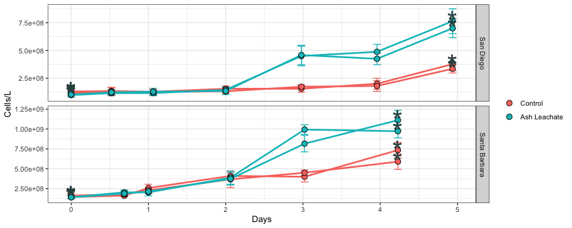
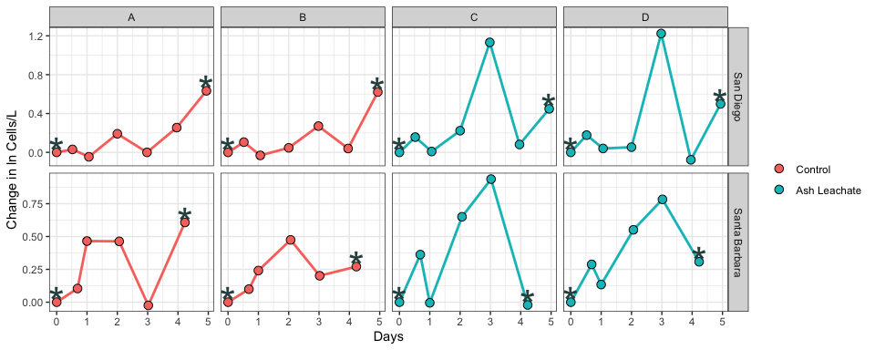
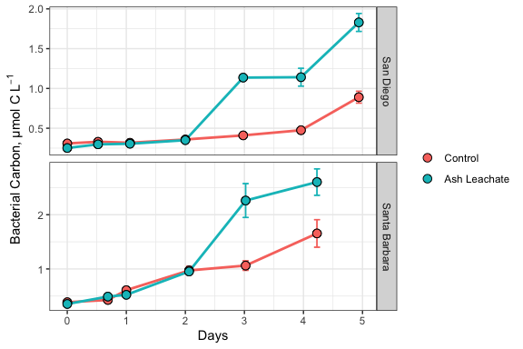
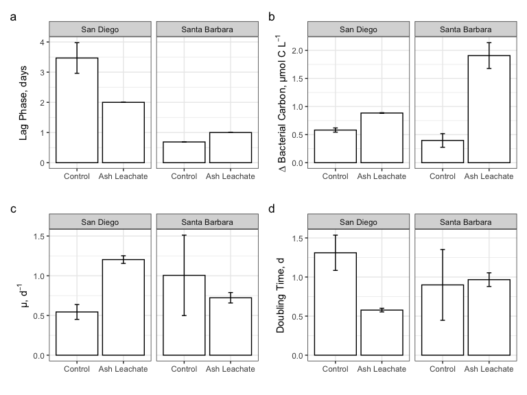

ACIDD Experiment Bacterial Abundance
================
Kerri Luttrell
10/24/2020

# Intro

This document shows how **individual bottl** bacterial abundance data
from ACIDD experiements were procesed, quality controlled, and analyzed.

``` r
library(tidyverse)
library(readxl)
library(lubridate)
```

# Import Data

``` r
excel_sheets("~/Github/144l_students/Input_Data/week3/ACIDD_Exp_BactAbund.xlsx")
```

    ## [1] "Metadata" "Data"

``` r
metadata <- read_excel("~/Github/144l_students/Input_Data/week3/ACIDD_Exp_BactAbund.xlsx", sheet= "Metadata" )
glimpse(metadata)
```

    ## Rows: 84
    ## Columns: 18
    ## $ Experiment              <chr> "ASH171", "ASH171", "ASH171", "ASH171", "ASH1…
    ## $ Location                <chr> "San Diego", "San Diego", "San Diego", "San D…
    ## $ Temperature_C           <dbl> 15, 15, 15, 15, 15, 15, 15, 15, 15, 15, 15, 1…
    ## $ Depth                   <dbl> 5, 5, 5, 5, 5, 5, 5, 5, 5, 5, 5, 5, 5, 5, 5, …
    ## $ Bottle                  <chr> "A", "A", "A", "A", "A", "A", "A", "A", "A", …
    ## $ Timepoint               <dbl> 0, 1, 2, 3, 4, 5, 6, 7, 8, 9, 10, 0, 1, 2, 3,…
    ## $ Treatment               <chr> "Control", "Control", "Control", "Control", "…
    ## $ Target_DOC_Amendment_uM <dbl> 0, 0, 0, 0, 0, 0, 0, 0, 0, 0, 0, 0, 0, 0, 0, …
    ## $ Inoculum_L              <dbl> 1.5, 1.5, 1.5, 1.5, 1.5, 1.5, 1.5, 1.5, 1.5, …
    ## $ Media_L                 <dbl> 4, 4, 4, 4, 4, 4, 4, 4, 4, 4, 4, 4, 4, 4, 4, …
    ## $ Datetime                <chr> "2017-12-16T21:30", "2017-12-17T10:00", "2017…
    ## $ TOC_Sample              <lgl> TRUE, FALSE, FALSE, FALSE, FALSE, FALSE, FALS…
    ## $ DOC_Sample              <lgl> TRUE, TRUE, FALSE, TRUE, FALSE, FALSE, FALSE,…
    ## $ Parallel_Sample         <lgl> TRUE, FALSE, FALSE, FALSE, FALSE, FALSE, FALS…
    ## $ Cell_Sample             <lgl> TRUE, TRUE, TRUE, TRUE, TRUE, TRUE, TRUE, FAL…
    ## $ DNA_Sample              <lgl> TRUE, FALSE, FALSE, FALSE, FALSE, FALSE, TRUE…
    ## $ Nutrient_Sample         <lgl> TRUE, FALSE, FALSE, FALSE, FALSE, FALSE, TRUE…
    ## $ DNA_SampleID            <chr> "ASH171-A0_S293", NA, NA, NA, NA, NA, "ASH171…

``` r
# 84 rows, 18 columns
# unique(metadata$Experiment)
# ASH171 ASH 172
# unique(metadata$Location)
# SD and SB
# unique(metadata$Bottle)
# 4 bottles per location
# unique(metadata$Treatment)
# Control and Ash Leachate
data <- read_excel("~/Github/144l_students/Input_Data/week3/ACIDD_Exp_BactAbund.xlsx", sheet= "Data" )
glimpse(data)
```

    ## Rows: 52
    ## Columns: 5
    ## $ Experiment  <chr> "ASH171", "ASH171", "ASH171", "ASH171", "ASH171", "ASH171…
    ## $ Bottle      <chr> "A", "A", "A", "A", "A", "A", "A", "B", "B", "B", "B", "B…
    ## $ Timepoint   <dbl> 0, 1, 2, 3, 4, 5, 6, 0, 1, 2, 3, 4, 5, 6, 0, 1, 2, 3, 4, …
    ## $ Cells_ml    <dbl> 130000, 134000, 128000, 155000, 155000, 200000, 377000, 1…
    ## $ Cells_ml_sd <dbl> 20900, 27600, 22200, 25200, 31900, 49100, 59700, 18400, 3…

``` r
# 52 rows and 5 columns
#join data from this with metadata, when you specify two objects it joins the right dataset to the left dataset

joined <- left_join(metadata, data)
```

    ## Joining, by = c("Experiment", "Bottle", "Timepoint")

``` r
# 84 rows (observations) and 20 variables
# names(joined)
# summary(joined)
glimpse(joined)
```

    ## Rows: 84
    ## Columns: 20
    ## $ Experiment              <chr> "ASH171", "ASH171", "ASH171", "ASH171", "ASH1…
    ## $ Location                <chr> "San Diego", "San Diego", "San Diego", "San D…
    ## $ Temperature_C           <dbl> 15, 15, 15, 15, 15, 15, 15, 15, 15, 15, 15, 1…
    ## $ Depth                   <dbl> 5, 5, 5, 5, 5, 5, 5, 5, 5, 5, 5, 5, 5, 5, 5, …
    ## $ Bottle                  <chr> "A", "A", "A", "A", "A", "A", "A", "A", "A", …
    ## $ Timepoint               <dbl> 0, 1, 2, 3, 4, 5, 6, 7, 8, 9, 10, 0, 1, 2, 3,…
    ## $ Treatment               <chr> "Control", "Control", "Control", "Control", "…
    ## $ Target_DOC_Amendment_uM <dbl> 0, 0, 0, 0, 0, 0, 0, 0, 0, 0, 0, 0, 0, 0, 0, …
    ## $ Inoculum_L              <dbl> 1.5, 1.5, 1.5, 1.5, 1.5, 1.5, 1.5, 1.5, 1.5, …
    ## $ Media_L                 <dbl> 4, 4, 4, 4, 4, 4, 4, 4, 4, 4, 4, 4, 4, 4, 4, …
    ## $ Datetime                <chr> "2017-12-16T21:30", "2017-12-17T10:00", "2017…
    ## $ TOC_Sample              <lgl> TRUE, FALSE, FALSE, FALSE, FALSE, FALSE, FALS…
    ## $ DOC_Sample              <lgl> TRUE, TRUE, FALSE, TRUE, FALSE, FALSE, FALSE,…
    ## $ Parallel_Sample         <lgl> TRUE, FALSE, FALSE, FALSE, FALSE, FALSE, FALS…
    ## $ Cell_Sample             <lgl> TRUE, TRUE, TRUE, TRUE, TRUE, TRUE, TRUE, FAL…
    ## $ DNA_Sample              <lgl> TRUE, FALSE, FALSE, FALSE, FALSE, FALSE, TRUE…
    ## $ Nutrient_Sample         <lgl> TRUE, FALSE, FALSE, FALSE, FALSE, FALSE, TRUE…
    ## $ DNA_SampleID            <chr> "ASH171-A0_S293", NA, NA, NA, NA, NA, "ASH171…
    ## $ Cells_ml                <dbl> 130000, 134000, 128000, 155000, 155000, 20000…
    ## $ Cells_ml_sd             <dbl> 20900, 27600, 22200, 25200, 31900, 49100, 597…

# Prepare Data

Convert date and time from being character values to dates, add column
with time elapsed for each experiment we must divide our data into
subsets then use that function on the subset to create a new column
convert cells/mL to cells/L, subset data to selecto only VOI & drop na’s

``` r
cells <- joined %>% 
  mutate(Datetime = ymd_hm(Datetime),
         cells = Cells_ml * 1000,
         sd_cells = Cells_ml_sd * 1000) %>%
  group_by(Experiment, Treatment, Bottle) %>%
  mutate(interv = interval(first(Datetime), Datetime),
         hours = interv /3600,
         days = hours/24) %>%
  ungroup() %>%
  select(Experiment:Nutrient_Sample, hours, days, cells:sd_cells) %>%
  drop_na(cells)
```

# Plot growth curves

Make
aesthetics

``` r
custom.colors <- c("Contol"= "dodgerblue2", "Ash Leachate" = "#4DAF4A", "Santa Barbara" = "#E41A1C", "San Diego" = "#FF7F00")
levels <- c("Control", "Ash Leachate", "San Diego", "Santa Barbara")
#dictates order things appear in groahs, legends
```

plot

``` r
cells %>%
  mutate(dna= ifelse(DNA_Sample == T, "*", NA)) %>%
  ggplot(aes(x = days, y = cells, group = 
               interaction (Experiment, Treatment, Bottle))) +
  geom_errorbar(aes(ymin = cells - sd_cells , ymax = cells + sd_cells, 
                    color = factor(Treatment, levels = levels)), width = 0.1)+
   geom_line(aes(color=factor(Treatment, levels = levels)), size = 1) +
  geom_point(aes(fill= factor(Treatment, levels = levels)), size = 3, color = "black", shape = 21)+
    geom_text(aes(label =dna ), size = 12, color = "darkslategray")+
  labs(x = "Days", y = "Cells/L", fill="") +
  facet_grid (rows= "Location", scales= "free") +
  guides(color = F) +
  theme_bw()
```

    ## Warning: Removed 36 rows containing missing values (geom_text).

<!-- -->

We can calculate: - The total change in cells from the initial
conditions to the end of the experiemnt - Specific growth rates as the
slope of lm(abundance) v time during the exponential growth ohase -
DOubling time as ln(2) divided by the specific growth rate - The mean of
each of the parameters of each treatment

First we will need to determine where exponential growth occurs in each
of the experiments, if it does. So let’s plot ln(abundance) v time.

# Identify exponential phase of growth

``` r
#how to calc natural log in r
# log(X) gives the natural log of x, not log base 10.
# log10(x) gives the loge base of 10
ln_cells <- cells%>%
  group_by(Experiment, Treatment, Bottle)%>%
  mutate(ln_cells = log(cells), 
         diff_ln_cells = ln_cells - lag(ln_cells, default = first(ln_cells))) %>%
  ungroup()
```

``` r
ln_cells %>%
  mutate(dna= ifelse(DNA_Sample == T, "*", NA)) %>%
  ggplot(aes(x = days, y = diff_ln_cells, group = 
               interaction (Experiment, Treatment, Bottle))) +
   geom_line(aes(color=factor(Treatment, levels = levels)), size = 1) +
  geom_point(aes(fill= factor(Treatment, levels = levels)), size = 3, color = "black", shape = 21)+
    geom_text(aes(label =dna ), size = 12, color = "darkslategray") +
  labs(x = "Days", y = "Change in ln Cells/L", fill="") +
    guides(color = F) +
  facet_grid (Location~Bottle, scales= "free") +
  theme_bw()
```

    ## Warning: Removed 36 rows containing missing values (geom_text).

<!-- -->

``` r
#facet grid determine how line graphs are separated and layered
#exponential phase is 0.5 to 1 in A bottle of SB, 3-5 in Bottle A of SD
#now we know where exponential growth occurs for everyone
```

This plot makes it a little easier to see, with the data that we have,
where exponential growht occurs for each bottle:

\-SD Bottle A ~3-5 d (T4-T6) -SD Bottle D ~4-5 d (T5-T6) -SD Bottle C
~2-3 d (T3-T4) -SD Bottle D ~2-3 d (T3-T4)

\-SB Bottle A ~0.5-1 d (T1-T2) -SB Bottle D ~0.5-2 d (T1-T3) -SB Bottle
C ~1-3 d (T2-T4) -SB Bottle D ~1-3 d (T2-T4)

# Calculate growth rates, doubling times, and change in cell abundance

``` r
growth <- ln_cells %>% 
  mutate( exp_start = ifelse(Experiment == "ASH171" & Bottle =="A", 4, NA),
          exp_start = ifelse(Experiment == "ASH171" & Bottle =="B", 5, exp_start),
          exp_start = ifelse(Experiment == "ASH171" & Bottle =="C", 3, exp_start),
          exp_start = ifelse(Experiment == "ASH171" & Bottle =="D", 3, exp_start),
          exp_start = ifelse(Experiment == "ASH172" & Bottle =="A", 1, exp_start),
          exp_start = ifelse(Experiment == "ASH172" & Bottle =="B", 1, exp_start),
          exp_start = ifelse(Experiment == "ASH172" & Bottle =="C", 2, exp_start),
          exp_start = ifelse(Experiment == "ASH172" & Bottle =="D", 2, exp_start),
          
          exp_end = ifelse(Experiment == "ASH171" & Bottle %in% c("A", "B"), 6, 4),
          exp_end = ifelse(Experiment == "ASH172" & Bottle== "A", 2, exp_end),
          exp_end = ifelse(Experiment == "ASH172" & Bottle == "B", 3, exp_end))%>%
  group_by(Experiment, Treatment, Bottle)%>%
          mutate(ln_cells_exp_start = ifelse(Timepoint == exp_start, ln_cells, NA),
                 ln_cells_exp_end = ifelse(Timepoint == exp_end,
                                           ln_cells, NA),
                 cells_exp_start = ifelse(Timepoint == exp_start, cells, NA),
                 cells_exp_end = ifelse(Timepoint == exp_end,
                                           cells, NA),
                 days_exp_start = ifelse(Timepoint == exp_start, days, NA),
                 days_exp_end = ifelse(Timepoint == exp_end,
                                           days, NA))%>%
  fill(ln_cells_exp_start:days_exp_end, .direction = "updown")%>%
  mutate(mew = (ln_cells_exp_end - ln_cells_exp_start)/(days_exp_end - days_exp_start),
         doubling = log(2)/mew,
         delta_cells = cells_exp_end - first(cells))%>%
  ungroup()
          
 # make a small dataframe to check to make sure you did what you wanted to do
 # check <-  growth %>% 
 #   select(Experiment, Bottle, exp_start, exp_end)%>%
 #   distinct()
```

# Convert bacterial abundance and change in bacterial abundance to carbon units

Apply a carbon conversion factor (CCF) ot bacterial abundance (cells
L<sup>-1</sup>) to generate bacterial carbon (µm CL<sup>-1</sup>)

We’ll aplly the average carbon content of bacterial plankton cells from
Coastal Japan (~30 fg C cell<sup>-1</sup>)

``` r
bactcarbon <- growth %>%
  mutate(bc = cells*(2.5 * 10^-9),
         delta_bc = delta_cells *(2.5 * 10^-9))
```

# Calculate treatment averages

``` r
# ave_bc is average of both controls bottles in location/experiment at same time
averages <- bactcarbon %>%
  group_by(Experiment, Treatment, Timepoint) %>%
  mutate(ave_bc = mean(bc),
         sd_bc = sd(bc))%>%
  ungroup()%>%
  group_by(Experiment, Treatment)%>%
  mutate(ave_mew = mean(mew),
         sd_mew = sd(mew),
         ave_doubling = mean(doubling),
         sd_doubling = sd(doubling),
         ave_delta_cells = mean (delta_cells),
         sd_delta_cells = sd(delta_cells),
         ave_delta_bc = mean(delta_bc),
         sd_delta_bc = sd(delta_bc),
         ave_lag = mean(days_exp_start),
         sd_lag = sd(days_exp_start)
         )%>%
  ungroup()
```

# Plot treatment averages

``` r
averages %>%
  ggplot(aes(x = days, y = ave_bc), group = 
               interaction (Experiment, Treatment)) +
  geom_errorbar(aes(ymin = ave_bc - sd_bc, ymax = ave_bc + sd_bc, color= factor( Treatment, levels= levels)), width =0.1)+
  geom_line(aes(color = factor (Treatment, levels=levels)), size = 1)+
  geom_point(aes(fill = factor(Treatment, levels = levels)), color = "black", shape= 21,size = 3)+
  facet_grid(row = "Location", scales= "free")+
  labs(x= "Days", y = expression("Bacterial Carbon, µmol C L"^-1), fill="", color = "")+
  guides(color= F)+
  theme_bw()
```

<!-- -->

# Barplots

``` r
bar.data <-  averages %>%
  select(Location, Treatment, ave_mew:sd_lag)%>%
  distinct()
```

Specific growth rate µ

``` r
mew <- bar.data %>%
  ggplot(aes(x=factor (Treatment, levels= levels), y = ave_mew), group = interaction(Location, Treatment)) +
  geom_col(color = "black", fill= "white")+
  geom_errorbar(aes(ymin= ave_mew - sd_mew, ymax = ave_mew + sd_mew), width = 0.1)+
  facet_grid(~factor(Location, levels = levels), scales= "free")+
  labs (x = " ", y = expression("µ, d"^-1))+
  theme_bw()
```

Doubling Time

``` r
doubling <- bar.data %>%
  ggplot(aes(x=factor (Treatment, levels= levels), y = ave_doubling), group = interaction(Location, Treatment)) +
  geom_col(color = "black", fill= "white")+
  geom_errorbar(aes(ymin= ave_doubling - sd_doubling, ymax = ave_doubling + sd_doubling), width = 0.1)+
  facet_grid(~factor(Location, levels = levels), scales= "free")+
  labs (x = " ", y = expression("Doubling Time, d"))+
  theme_bw()
```

∆ bacterial carbon

``` r
delta_bc <- bar.data %>%
  ggplot(aes(x=factor (Treatment, levels= levels), y = ave_delta_bc), group = interaction(Location, Treatment)) +
  geom_col(color = "black", fill= "white")+
  geom_errorbar(aes(ymin= ave_delta_bc - sd_delta_bc, ymax = ave_delta_bc + sd_delta_bc), width = 0.1)+
  facet_grid(~factor(Location, levels = levels), scales= "free")+
  labs (x = " ", y = expression("∆ Bacterial Carbon, µmol C L"^-1))+
  theme_bw()
```

Duration of lag phase

``` r
lag <- bar.data %>%
  ggplot(aes(x=factor (Treatment, levels= levels), y = ave_lag), group = interaction(Location, Treatment)) +
  geom_col(color = "black", fill= "white")+
  geom_errorbar(aes(ymin= ave_lag - sd_lag, ymax = ave_lag + sd_lag), width = 0.1)+
  facet_grid(~factor(Location, levels = levels), scales= "free")+
  labs (x = " ", y = "Lag Phase, days")+
  theme_bw()
```

Attach all similar plots together in one
figure

``` r
library(patchwork)
```

``` r
lag + delta_bc + mew + doubling + plot_annotation(tag_levels = "a")
```

<!-- -->

# Save Data

``` r
saveRDS(averages, "~/Github/144l_students/Input_Data/week3/ACIDD_Exp_Processed_BactAbund.rds")
```
