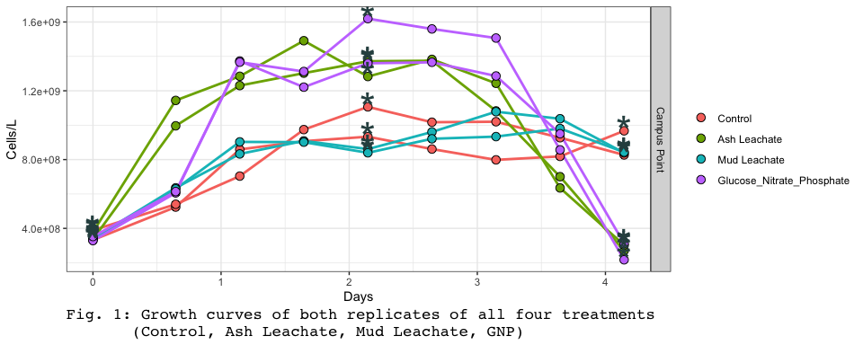
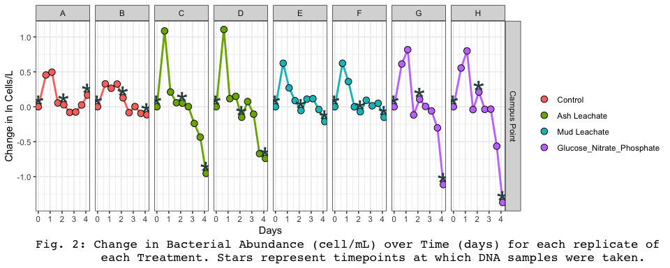
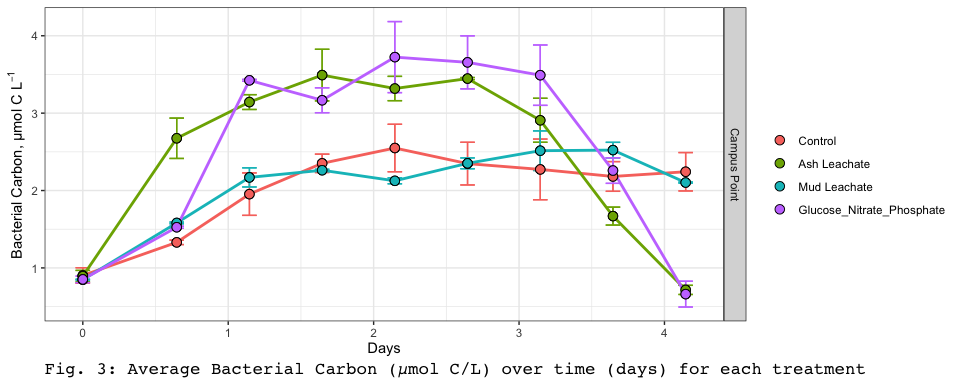
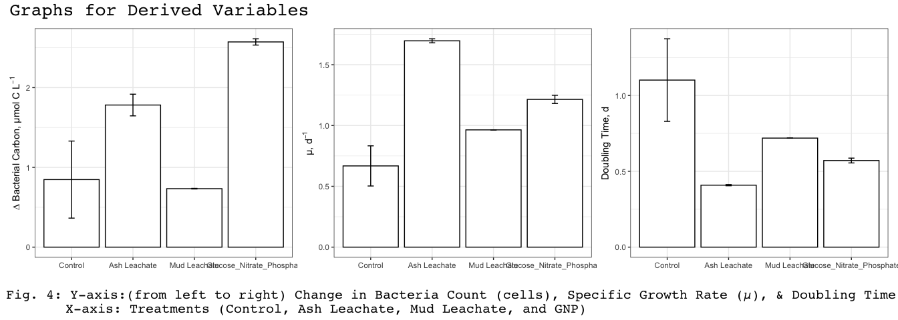

Week 3 Assignment
================
Kerri Luttrell
10/27/2020

## Load Libraries

``` r
knitr::opts_chunk$set(echo = TRUE)
setwd("~/Github/144l_students/Input_Data/week3")
library(tidyverse)
library(readxl)
library(lubridate)
```

## Load and Prepare Data

``` r
# excel_sheets("~/Github/144l_students/Input_Data/week3/144L_2018_BactAbund.xlsx")

metadata <- read_excel("~/Github/144l_students/Input_Data/week3/144L_2018_BactAbund.xlsx", sheet = "Metadata")
# glimpse(metadata)

# rows=80 columns= 16 

data <- read_excel("~/Github/144l_students/Input_Data/week3/144L_2018_BactAbund.xlsx", sheet = "Data")
# glimpse(data)
# 72 rows 3 columns (bottle, timepoint, cells_ml)

joined <- left_join(metadata, data)
```

    ## Joining, by = c("Bottle", "Timepoint")

``` r
# glimpse(joined)
# rows= 80 columns =17 (added cells_ml column)
```

## Select Data

``` r
cells <- joined %>% 
  mutate(Datetime = ymd_hm(Datetime),
         cells = Cells_ml * 1000) %>%
  group_by(Experiment, Treatment, Bottle) %>%
  mutate(interv = interval(first(Datetime), Datetime),
         hours = interv /3600,
         days = hours/24) %>%
  ungroup() %>%
  select(Experiment:Target_DOC_Amendment, TOC_Sample:DNA_SampleID, hours, days, cells) %>%
  drop_na(cells)
```

## Plot Growth Curves

``` r
levels <- c("Control", "Ash Leachate", "Mud Leachate", "Glucose_Nitrate_Phosphate")
#DNA samples taken at timepoints 0,4,8 2x per treamtnet
# no cell points taken on timepoint 9
cells %>%
  mutate(dna= ifelse(DNA_Sample == T, "*", NA)) %>%
  ggplot(aes(x = days, y = cells, group = 
               interaction (Experiment, Treatment, Bottle))) +
   geom_line(aes(color=factor(Treatment, levels = levels)), size = 1) +
  geom_point(aes(fill= factor(Treatment, levels = levels)), size = 3, color = "black", shape = 21)+
    geom_text(aes(label = dna ), size = 12, color = "darkslategray")+
  labs(x = "Days", y = "Cells/L", fill="",caption= "Fig. 1: Growth curves of both replicates of all four treatments 
       (Control, Ash Leachate, Mud Leachate, GNP) ") +
  facet_grid (rows= "Location", scales= "free") +
  guides(color = F) +
  theme_bw()+
  theme(
  plot.caption = element_text('mono', hjust = 0, size = 13,)
)
```

<!-- -->

``` r
#stars indicate where DNA samples were taken
```

## Identify exponential phase of growth

``` r
#how to calc natural log in r
# log(X) gives the natural log of x, not log base 10.
# log10(x) gives the loge base of 10
ln_cells <- cells%>%
  group_by(Experiment, Treatment, Bottle)%>%
  mutate(ln_cells = log(cells), 
         diff_ln_cells = ln_cells - lag(ln_cells, default = first(ln_cells))) %>%
  ungroup()
```

``` r
ln_cells %>%
  mutate(dna= ifelse(DNA_Sample == T, "*", NA)) %>%
  ggplot(aes(x = days, y = diff_ln_cells, group = 
               interaction (Experiment, Treatment, Bottle))) +
   geom_line(aes(color=factor(Treatment, levels = levels)), size = 1) +
  geom_point(aes(fill= factor(Treatment, levels = levels)), size = 3, color = "black", shape = 21)+
    geom_text(aes(label =dna ), size = 12, color = "darkslategray") +
  labs(x = "Days", y = "Change in ln Cells/L", fill="", caption = "Fig. 2: Change in Bacterial Abundance (cell/mL) over Time (days) for each replicate of 
         each Treatment. Stars represent timepoints at which DNA samples were taken.") +
    guides(color = F) +
  facet_grid (Location~Bottle, scales= "free") +
  theme_bw()+
  theme(
  plot.caption = element_text('mono', hjust = 0, size = 13))
```

    ## Warning: Removed 48 rows containing missing values (geom_text).

<!-- -->

**Exponential Phases Determined from Graph**

  - Control A ~0-1 d (T0-T2)

  - Control B ~0-0.5 d (T0-T1)

  - Ash C ~0-0.5 d (T0-T1)

  - Ash D ~0-0.5 d (T0-T1)

  - Mud E ~0-0.5 d (T0-T1)

  - Mud F ~0-0.5 d (T0-T1)

  - GNP G ~0-1 d (T0-T2)

  - GNP H ~0-1 d (T0-T2)

## Calculate growth rates, doubling times, and change in cell abundance

``` r
growth <- ln_cells %>% 
  mutate( exp_start = 0,
           exp_end = ifelse(Bottle %in% c("A", "G", "H"), 2, 1))%>%
  group_by(Experiment, Treatment, Bottle)%>%
          mutate(ln_cells_exp_start = ifelse(Timepoint == exp_start, ln_cells, NA),
                 ln_cells_exp_end = ifelse(Timepoint == exp_end,
                                           ln_cells, NA),
                 cells_exp_start = ifelse(Timepoint == exp_start, cells, NA),
                 cells_exp_end = ifelse(Timepoint == exp_end,
                                           cells, NA),
                 days_exp_start = ifelse(Timepoint == exp_start, days, NA),
                 days_exp_end = ifelse(Timepoint == exp_end,
                                           days, NA))%>%
  fill(ln_cells_exp_start:days_exp_end, .direction = "updown")%>%
  mutate(mew = (ln_cells_exp_end - ln_cells_exp_start)/(days_exp_end - days_exp_start),
         doubling = log(2)/mew,
         delta_cells = cells_exp_end - first(cells))%>%
  ungroup()
```

## Convert bacterial abundance and change in bacterial abundance to carbon units

Apply a carbon conversion factor (CCF) ot bacterial abundance (cells
L<sup>-1</sup>) to generate bacterial carbon (µm CL<sup>-1</sup>)

CCF= ~30 fg C cell<sup>-1</sup>

``` r
bactcarbon <- growth %>%
  mutate(bc = cells*(2.5 * 10^-9),
         delta_bc = delta_cells *(2.5 * 10^-9))
```

## Calculate treatment averages

``` r
averages <- bactcarbon %>%
  group_by( Treatment, Timepoint) %>%
  mutate(ave_bc = mean(bc),
         sd_bc = sd(bc))%>%
  ungroup()%>%
  group_by( Treatment)%>%
  mutate(ave_mew = mean(mew),
         sd_mew = sd(mew),
         ave_doubling = mean(doubling),
         sd_doubling = sd(doubling),
         ave_delta_cells = mean (delta_cells),
         sd_delta_cells = sd(delta_cells),
         ave_delta_bc = mean(delta_bc),
         sd_delta_bc = sd(delta_bc),
         ave_lag = mean(days_exp_start),
         sd_lag = sd(days_exp_start)
         )%>%
  ungroup()
```

## Plot treatment averages

``` r
averages %>%
  ggplot(aes(x = days, y = ave_bc), group = 
               interaction ( Treatment)) +
  geom_errorbar(aes(ymin = ave_bc - sd_bc, ymax = ave_bc + sd_bc, color= factor( Treatment, levels= levels)), width =0.1)+
  geom_line(aes(color = factor (Treatment, levels=levels)), size = 1)+
  geom_point(aes(fill = factor(Treatment, levels = levels)), color = "black", shape= 21,size = 3)+
  facet_grid(row = "Location", scales= "free")+
  labs(x= "Days", y = expression("Bacterial Carbon, µmol C L"^-1), fill="", color = "", caption= "Fig. 3: Average Bacterial Carbon (µmol C/L) over time (days) for each treatment")+
  guides(color= F)+
  theme_bw()+
  theme(
  plot.caption = element_text('mono', hjust = 0, size = 13))
```

<!-- -->

## Barplots

``` r
bar.data <-  averages %>%
  select( Treatment, ave_mew:sd_lag)%>%
  distinct()
```

Attach all similar plots together in one
figure

``` r
library(patchwork)
```

``` r
delta_bc + mew + doubling + plot_annotation( title= "Graphs for Derived Variables", caption= "Fig. 4: Y-axis:(from left to right) Change in Bacteria Count (cells), Specific Growth Rate (µ), & Doubling Time   
   X-axis: Treatments (Control, Ash Leachate, Mud Leachate, and GNP)  ",
theme = theme(
    plot.title = element_text(size = 20),
    plot.caption = element_text(hjust=0.1, size = 15))& 
  theme(text = element_text(hjust= 0, 'mono')))
```

<!-- -->

## Analysis

In this assignment I loaded and prepared data from the EEMB 144L 2018
class’s Dark bottle Experiment. The water samples prepared for the dark
bottle experiment were taken from Campus Point. The four treatments were
a control, ash leachate, mud leachate, and Glucose Nitrate Phosphate.
Each treatment was repeated twice. Bacterial abundance reached higher
numbers in the ash leachate and glucose nitrate phosphate treatments
than the Control or Mud Leachate treatments (Fig. 1). Ash leachate had
the most rapid initial growth. Both Ash Leachate and GNP bottle
populations crashed by the fourth day, below the starting abundance.
Control and Mud Leachate had a net increase in cell abundance by the
fourth day (Fig. 1). The maximum Bacterial Carbon level reached was on
day 2 by the GNP treatment at just over 3.5 µmol C/L.

Although Ash Leachate had the fastest doubling time and highest specific
growth rate, the GNP treatment produced a greater change in bacterial
carbon. Despite allowing for quick growth, it is possible that the ash
leachate carbon source is either not as bioavailable as glucose or the
ash leachate media lacks the necessary nitrogen and phosphorus for
complete utilization of the carbon source. The control, which had no
additional carbon input, showed the least amount of bacterial carbon
produced, lowest µ, and slowest doubling time. This result is consistent
with good experimental design.
