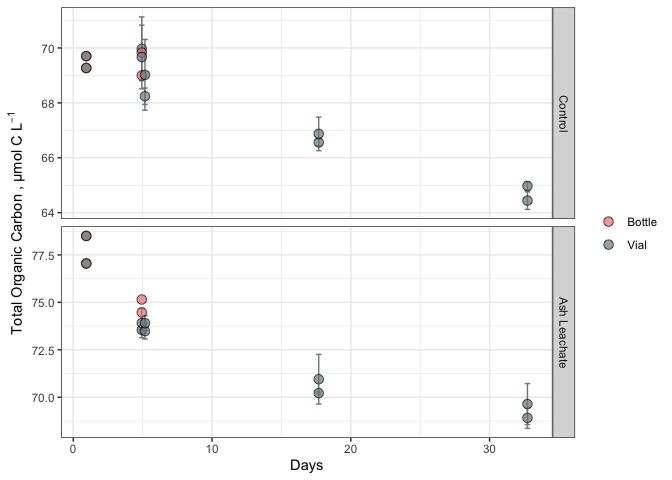
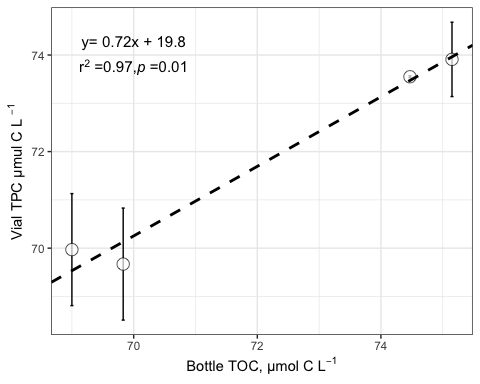

144L week \#3 notes
================
Kerri Luttrell
11/1/2020

# Intro

This document shows how **individual bottle** TOC/DOC data from ACIDD
remineralization experiments were processed, QC’ed , adn analyzed.

``` r
library (tidyverse)
library(readxl)
library(lubridate)
library(broman)

library(plyr)
```

``` r
excel_sheets("~/Github/144l_students/Input_Data/week4/ACIDD_Exp_TOC.xlsx")
```

    ## [1] "Metadata" "Data"

``` r
metadata <- read_excel("~/Github/144l_students/Input_Data/week4/ACIDD_Exp_TOC.xlsx", sheet = "Metadata")

data <- read_excel("~/Github/144l_students/Input_Data/week4/ACIDD_Exp_TOC.xlsx", sheet= "Data")
```

``` r
glimpse(metadata)
```

    ## Rows: 84
    ## Columns: 18
    ## $ Experiment              <chr> "ASH171", "ASH171", "ASH171", "ASH171", "ASH1…
    ## $ Location                <chr> "San Diego", "San Diego", "San Diego", "San D…
    ## $ Temperature_C           <dbl> 15, 15, 15, 15, 15, 15, 15, 15, 15, 15, 15, 1…
    ## $ Depth                   <dbl> 5, 5, 5, 5, 5, 5, 5, 5, 5, 5, 5, 5, 5, 5, 5, …
    ## $ Bottle                  <chr> "A", "A", "A", "A", "A", "A", "A", "A", "A", …
    ## $ Timepoint               <dbl> 0, 1, 2, 3, 4, 5, 6, 7, 8, 9, 10, 0, 1, 2, 3,…
    ## $ Treatment               <chr> "Control", "Control", "Control", "Control", "…
    ## $ Target_DOC_Amendment_uM <dbl> 0, 0, 0, 0, 0, 0, 0, 0, 0, 0, 0, 0, 0, 0, 0, …
    ## $ Inoculum_L              <dbl> 1.5, 1.5, 1.5, 1.5, 1.5, 1.5, 1.5, 1.5, 1.5, …
    ## $ Media_L                 <dbl> 4, 4, 4, 4, 4, 4, 4, 4, 4, 4, 4, 4, 4, 4, 4, …
    ## $ Datetime                <chr> "2017-12-16T21:30", "2017-12-17T10:00", "2017…
    ## $ TOC_Sample              <lgl> TRUE, FALSE, FALSE, FALSE, FALSE, FALSE, FALS…
    ## $ DOC_Sample              <lgl> TRUE, TRUE, FALSE, TRUE, FALSE, FALSE, FALSE,…
    ## $ Parallel_Sample         <lgl> TRUE, FALSE, FALSE, FALSE, FALSE, FALSE, FALS…
    ## $ Cell_Sample             <lgl> TRUE, TRUE, TRUE, TRUE, TRUE, TRUE, TRUE, FAL…
    ## $ DNA_Sample              <lgl> TRUE, FALSE, FALSE, FALSE, FALSE, FALSE, TRUE…
    ## $ Nutrient_Sample         <lgl> TRUE, FALSE, FALSE, FALSE, FALSE, FALSE, TRUE…
    ## $ DNA_SampleID            <chr> "ASH171-A0_S293", NA, NA, NA, NA, NA, "ASH171…

``` r
#84 rows, 18 columns
```

``` r
glimpse(data)
```

    ## Rows: 76
    ## Columns: 7
    ## $ Experiment <chr> "ASH171", "ASH171", "ASH171", "ASH171", "ASH171", "ASH171"…
    ## $ Bottle     <chr> "A", "A", "A", "A", "A", "A", "A", "A", "A", "A", "B", "B"…
    ## $ Timepoint  <dbl> 0, 1, 2, 3, 4, 5, 6, 7, 8, 9, 0, 1, 2, 3, 4, 5, 6, 7, 8, 9…
    ## $ TOC        <dbl> NA, NA, NA, NA, NA, NA, NA, NA, NA, NA, NA, NA, NA, NA, NA…
    ## $ TOC_sd     <lgl> NA, NA, NA, NA, NA, NA, NA, NA, NA, NA, NA, NA, NA, NA, NA…
    ## $ PTOC       <dbl> NA, NA, NA, NA, NA, NA, NA, NA, NA, NA, NA, NA, NA, NA, NA…
    ## $ PTOC_sd    <dbl> NA, NA, NA, NA, NA, NA, NA, NA, NA, NA, NA, NA, NA, NA, NA…

``` r
# 76 rows, 7 columns
view(data)
```

TOC: samples taken directly from bottle incubations PTOC: samples
sacrificially taken from incubation vials (goes beyond duration of
bottle samples)

\#Prepare Data

``` r
joined <-  left_join (metadata, data)
```

    ## Joining, by = c("Experiment", "Bottle", "Timepoint")

``` r
toc <-  joined %>%
 mutate(Datetime = ymd_hm(Datetime))%>%
  group_by (Experiment, Bottle)%>%
  mutate ( interv = interval(first(Datetime), Datetime),
                hours = as.numeric(interv)/3600,
                days = hours/24) %>%
  ungroup() %>%
    dplyr::rename(sd_TOC = TOC_sd,
         sd_PTOC = PTOC_sd)%>%
  select(Experiment:Datetime, hours, days, everything(), -c(contains("Sample")))
   glimpse(toc)
```

    ## Rows: 84
    ## Columns: 18
    ## $ Experiment              <chr> "ASH171", "ASH171", "ASH171", "ASH171", "ASH1…
    ## $ Location                <chr> "San Diego", "San Diego", "San Diego", "San D…
    ## $ Temperature_C           <dbl> 15, 15, 15, 15, 15, 15, 15, 15, 15, 15, 15, 1…
    ## $ Depth                   <dbl> 5, 5, 5, 5, 5, 5, 5, 5, 5, 5, 5, 5, 5, 5, 5, …
    ## $ Bottle                  <chr> "A", "A", "A", "A", "A", "A", "A", "A", "A", …
    ## $ Timepoint               <dbl> 0, 1, 2, 3, 4, 5, 6, 7, 8, 9, 10, 0, 1, 2, 3,…
    ## $ Treatment               <chr> "Control", "Control", "Control", "Control", "…
    ## $ Target_DOC_Amendment_uM <dbl> 0, 0, 0, 0, 0, 0, 0, 0, 0, 0, 0, 0, 0, 0, 0, …
    ## $ Inoculum_L              <dbl> 1.5, 1.5, 1.5, 1.5, 1.5, 1.5, 1.5, 1.5, 1.5, …
    ## $ Media_L                 <dbl> 4, 4, 4, 4, 4, 4, 4, 4, 4, 4, 4, 4, 4, 4, 4, …
    ## $ Datetime                <dttm> 2017-12-16 21:30:00, 2017-12-17 10:00:00, 20…
    ## $ hours                   <dbl> 0.0, 12.5, 25.5, 48.0, 71.5, 95.0, 118.5, 122…
    ## $ days                    <dbl> 0.0000000, 0.5208333, 1.0625000, 2.0000000, 2…
    ## $ TOC                     <dbl> NA, NA, NA, NA, NA, NA, NA, NA, NA, NA, NA, N…
    ## $ sd_TOC                  <lgl> NA, NA, NA, NA, NA, NA, NA, NA, NA, NA, NA, N…
    ## $ PTOC                    <dbl> NA, NA, NA, NA, NA, NA, NA, NA, NA, NA, NA, N…
    ## $ sd_PTOC                 <dbl> NA, NA, NA, NA, NA, NA, NA, NA, NA, NA, NA, N…
    ## $ interv                  <Interval> 2017-12-16 21:30:00 UTC--2017-12-16 21:3…

``` r
glimpse(toc)
```

    ## Rows: 84
    ## Columns: 18
    ## $ Experiment              <chr> "ASH171", "ASH171", "ASH171", "ASH171", "ASH1…
    ## $ Location                <chr> "San Diego", "San Diego", "San Diego", "San D…
    ## $ Temperature_C           <dbl> 15, 15, 15, 15, 15, 15, 15, 15, 15, 15, 15, 1…
    ## $ Depth                   <dbl> 5, 5, 5, 5, 5, 5, 5, 5, 5, 5, 5, 5, 5, 5, 5, …
    ## $ Bottle                  <chr> "A", "A", "A", "A", "A", "A", "A", "A", "A", …
    ## $ Timepoint               <dbl> 0, 1, 2, 3, 4, 5, 6, 7, 8, 9, 10, 0, 1, 2, 3,…
    ## $ Treatment               <chr> "Control", "Control", "Control", "Control", "…
    ## $ Target_DOC_Amendment_uM <dbl> 0, 0, 0, 0, 0, 0, 0, 0, 0, 0, 0, 0, 0, 0, 0, …
    ## $ Inoculum_L              <dbl> 1.5, 1.5, 1.5, 1.5, 1.5, 1.5, 1.5, 1.5, 1.5, …
    ## $ Media_L                 <dbl> 4, 4, 4, 4, 4, 4, 4, 4, 4, 4, 4, 4, 4, 4, 4, …
    ## $ Datetime                <dttm> 2017-12-16 21:30:00, 2017-12-17 10:00:00, 20…
    ## $ hours                   <dbl> 0.0, 12.5, 25.5, 48.0, 71.5, 95.0, 118.5, 122…
    ## $ days                    <dbl> 0.0000000, 0.5208333, 1.0625000, 2.0000000, 2…
    ## $ TOC                     <dbl> NA, NA, NA, NA, NA, NA, NA, NA, NA, NA, NA, N…
    ## $ sd_TOC                  <lgl> NA, NA, NA, NA, NA, NA, NA, NA, NA, NA, NA, N…
    ## $ PTOC                    <dbl> NA, NA, NA, NA, NA, NA, NA, NA, NA, NA, NA, N…
    ## $ sd_PTOC                 <dbl> NA, NA, NA, NA, NA, NA, NA, NA, NA, NA, NA, N…
    ## $ interv                  <Interval> 2017-12-16 21:30:00 UTC--2017-12-16 21:3…

``` r
#84 rows, 17 columns
```

# PLot the curves

## Pivot data

``` r
pivot_toc <- toc %>% 
  select(Experiment, Location, Bottle, Treatment, days, TOC, PTOC) %>%
  pivot_longer(TOC:PTOC, names_to = "sample", values_to = "value")

# used pivot longer to expand number of rows and decrease the number of columns

pivot_toc_sd <- toc %>%
   select(Experiment, Location, Bottle, Treatment, days, sd_TOC, sd_PTOC) %>%
  pivot_longer(sd_TOC:sd_PTOC, names_to = "sample", names_prefix= "sd_", values_to = "sd")

pivoted <- left_join (pivot_toc,pivot_toc_sd) %>%
  mutate(sample = ifelse(sample=="TOC", "Bottle", "Vial"))
```

    ## Joining, by = c("Experiment", "Location", "Bottle", "Treatment", "days", "sample")

``` r
#this mutate replaced the data input in the column with news names/proxies, whereas rename renames the columns
```

``` r
custom.colors <- c("Control"= "Cadet Blue", "Ash Leachate"="Perwinkle", "Santa Barbara" = "Wistera", "San Diego" = "Orchid", "Vial"= "lightcyan4", "Bottle"= "lightcoral")

levels <- c("Control", "Ash Leachate", "San Diego", "Santa Barbara", "Bottle", "Vial")

pivoted %>%
  filter (Location == "Santa Barbara") %>%
  drop_na (value) %>%
  mutate(Treatment = factor(Treatment, levels = levels), sample = factor(sample, levels = levels))%>%
  ggplot(aes(x =days, y = value, group = interaction(Treatment, Bottle)))+
  geom_errorbar(aes(ymin = value - sd, ymax = value + sd, color = sample), width = 0.4)+
  geom_point(aes(fill = sample ), size = 3, shape = 21, alpha = 0.7)+
  labs (x = "Days", y = expression ("Total Organic Carbon , µmol C L"^-1), colro = "", fill= "") +
  scale_color_manual(values = custom.colors)+
  scale_fill_manual(values= custom.colors)+
  theme_bw()+
  facet_grid(rows = "Treatment", scales = "free")+
  guides (color=F)
```

<!-- -->
The analytical detection limit for our TOC analysis is -1.5 µmol C
L<sup>-1</sup>.

# TOC v PTOC (bottle v vial samples)

we want to make sure that samples taken from bottle and vial at same
time point are similar

``` r
library(lmodel2)
#lmodel2 is used when neither x or y variable are controlled or dependent on each other, both have error surrounding measurements
reg.data <- toc %>% 
  drop_na(TOC)%>%
  filter(Timepoint >0)
#TOC measurement at initial timepoint is same between bottol and vial so we only care about timepoints greater than 0

reg <- lmodel2(PTOC ~TOC, data = reg.data, nperm =90)
```

    ## RMA was not requested: it will not be computed.

``` r
#this places toc values on x axis and ptoc on y axis, n perm stands for number of times the statistical model is run
```

``` r
reg
```

    ## 
    ## Model II regression
    ## 
    ## Call: lmodel2(formula = PTOC ~ TOC, data = reg.data, nperm = 90)
    ## 
    ## n = 4   r = 0.9866202   r-square = 0.9734195 
    ## Parametric P-values:   2-tailed = 0.01337976    1-tailed = 0.006689882 
    ## Angle between the two OLS regression lines = 0.7319938 degrees
    ## 
    ## Permutation tests of OLS, MA, RMA slopes: 1-tailed, tail corresponding to sign
    ## A permutation test of r is equivalent to a permutation test of the OLS slope
    ## P-perm for SMA = NA because the SMA slope cannot be tested
    ## 
    ## Regression results
    ##   Method Intercept     Slope Angle (degrees) P-perm (1-tailed)
    ## 1    OLS  20.53052 0.7106186        35.39831         0.1318681
    ## 2     MA  20.05813 0.7171693        35.64693         0.1318681
    ## 3    SMA  19.83558 0.7202554        35.76352                NA
    ## 
    ## Confidence intervals
    ##   Method 2.5%-Intercept 97.5%-Intercept 2.5%-Slope 97.5%-Slope
    ## 1    OLS      -5.251071        46.31211  0.3533544    1.067883
    ## 2     MA     -12.423031        42.82588  0.4014438    1.167593
    ## 3    SMA     -11.966197        39.56023  0.4467293    1.161258
    ## 
    ## Eigenvalues: 14.93615 0.09037159 
    ## 
    ## H statistic used for computing C.I. of MA: 0.05669009

``` r
intercept <-  reg$regression.results[3,2]
slope <-  reg$regression.results[3,3]

two_int <- reg$confidence.intervals[3,2]
two_slope <- reg$confidence.intervals[3,4]
nine_int <-  reg$confidence.intervals[3,3]
nine_slope <- reg$confidence.intervals[3,5]
```

``` r
reg.data%>%
  ggplot(aes( x = TOC, y = PTOC)) +
  geom_errorbar(aes(ymin = PTOC - sd_PTOC, ymax = PTOC + sd_PTOC), width = 0.05) +
  geom_point(fill = "white", shape = 21, size =4, alpha =0.7) +
  geom_abline(intercept = intercept, slope = slope, color = "black", linetype= 2, size = 1)+
  geom_abline(intercept = two_int, slope= two_slope, color = "black", linetype = 3 , size = 1)+
    geom_abline(intercept = nine_int, slope = nine_slope, color = "black", linetype = 3, size = 1) +
    labs(x = expression ("Bottle TOC, µmol C L"^-1), y = expression ("Vial TPC µmul C L " ^-1))+
    theme_bw()+
    annotate ( geom = "text", label = expression (atop("y= 0.72x + 19.8", paste ("r"^2," =0.97," , italic("p "), "=0.01"))), x =70,y=74,size=4)
```

    ## Warning in is.na(x): is.na() applied to non-(list or vector) of type
    ## 'expression'

<!-- -->

good linear fit between two parameters but there is about a 28%
difference between coressponding measurements when they are different.
However this 28% limit is within the detection limit of the methodology
(1.5) so they are not significantly different form one
another.

``` r
bc <-  read_rds("~/Github/144l_students/Input_Data/week3/ACIDD_Exp_Processed_BactAbund.rds")
```

``` r
merge <- left_join(toc, bc %>% select(-c(Datetime, days, hours)))%>%
  select (Experiment:days, TOC:sd_PTOC, cells:diff_ln_cells, bc, ave_bc, sd_bc, everything(), -c(contains("Sample")) ) %>%
  group_by(Experiment, Treatment, Bottle) %>%
  fill(exp_start:sd_lag) %>%
  ungroup()
```

    ## Joining, by = c("Experiment", "Location", "Bottle", "Timepoint", "Treatment", "Target_DOC_Amendment_uM", "Inoculum_L", "Media_L")

``` r
glimpse(merge)
```

    ## Rows: 84
    ## Columns: 47
    ## $ Experiment              <chr> "ASH171", "ASH171", "ASH171", "ASH171", "ASH1…
    ## $ Location                <chr> "San Diego", "San Diego", "San Diego", "San D…
    ## $ Temperature_C           <dbl> 15, 15, 15, 15, 15, 15, 15, 15, 15, 15, 15, 1…
    ## $ Depth                   <dbl> 5, 5, 5, 5, 5, 5, 5, 5, 5, 5, 5, 5, 5, 5, 5, …
    ## $ Bottle                  <chr> "A", "A", "A", "A", "A", "A", "A", "A", "A", …
    ## $ Timepoint               <dbl> 0, 1, 2, 3, 4, 5, 6, 7, 8, 9, 10, 0, 1, 2, 3,…
    ## $ Treatment               <chr> "Control", "Control", "Control", "Control", "…
    ## $ Target_DOC_Amendment_uM <dbl> 0, 0, 0, 0, 0, 0, 0, 0, 0, 0, 0, 0, 0, 0, 0, …
    ## $ Inoculum_L              <dbl> 1.5, 1.5, 1.5, 1.5, 1.5, 1.5, 1.5, 1.5, 1.5, …
    ## $ Media_L                 <dbl> 4, 4, 4, 4, 4, 4, 4, 4, 4, 4, 4, 4, 4, 4, 4, …
    ## $ Datetime                <dttm> 2017-12-16 21:30:00, 2017-12-17 10:00:00, 20…
    ## $ hours                   <dbl> 0.0, 12.5, 25.5, 48.0, 71.5, 95.0, 118.5, 122…
    ## $ days                    <dbl> 0.0000000, 0.5208333, 1.0625000, 2.0000000, 2…
    ## $ TOC                     <dbl> NA, NA, NA, NA, NA, NA, NA, NA, NA, NA, NA, N…
    ## $ sd_TOC                  <lgl> NA, NA, NA, NA, NA, NA, NA, NA, NA, NA, NA, N…
    ## $ PTOC                    <dbl> NA, NA, NA, NA, NA, NA, NA, NA, NA, NA, NA, N…
    ## $ sd_PTOC                 <dbl> NA, NA, NA, NA, NA, NA, NA, NA, NA, NA, NA, N…
    ## $ cells                   <dbl> 1.30e+08, 1.34e+08, 1.28e+08, 1.55e+08, 1.55e…
    ## $ sd_cells                <dbl> 20900000, 27600000, 22200000, 25200000, 31900…
    ## $ ln_cells                <dbl> 18.68305, 18.71335, 18.66754, 18.85894, 18.85…
    ## $ diff_ln_cells           <dbl> 0.000000000, 0.030305349, -0.045809536, 0.191…
    ## $ bc                      <dbl> 0.32500, 0.33500, 0.32000, 0.38750, 0.38750, …
    ## $ ave_bc                  <dbl> 0.308750, 0.330000, 0.317500, 0.358750, 0.410…
    ## $ sd_bc                   <dbl> 0.022980970, 0.007071068, 0.003535534, 0.0406…
    ## $ interv                  <Interval> 2017-12-16 21:30:00 UTC--2017-12-16 21:3…
    ## $ exp_start               <dbl> 4, 4, 4, 4, 4, 4, 4, 4, 4, 4, 4, 5, 5, 5, 5, …
    ## $ exp_end                 <dbl> 6, 6, 6, 6, 6, 6, 6, 6, 6, 6, 6, 6, 6, 6, 6, …
    ## $ ln_cells_exp_start      <dbl> 18.85894, 18.85894, 18.85894, 18.85894, 18.85…
    ## $ ln_cells_exp_end        <dbl> 19.74776, 19.74776, 19.74776, 19.74776, 19.74…
    ## $ cells_exp_start         <dbl> 1.55e+08, 1.55e+08, 1.55e+08, 1.55e+08, 1.55e…
    ## $ cells_exp_end           <dbl> 3.77e+08, 3.77e+08, 3.77e+08, 3.77e+08, 3.77e…
    ## $ days_exp_start          <dbl> 2.979167, 2.979167, 2.979167, 2.979167, 2.979…
    ## $ days_exp_end            <dbl> 4.937500, 4.937500, 4.937500, 4.937500, 4.937…
    ## $ mew                     <dbl> 0.4538656, 0.4538656, 0.4538656, 0.4538656, 0…
    ## $ doubling                <dbl> 1.5272081, 1.5272081, 1.5272081, 1.5272081, 1…
    ## $ delta_cells             <dbl> 247000000, 247000000, 247000000, 247000000, 2…
    ## $ delta_bc                <dbl> 0.61750, 0.61750, 0.61750, 0.61750, 0.61750, …
    ## $ ave_mew                 <dbl> 0.5441279, 0.5441279, 0.5441279, 0.5441279, 0…
    ## $ sd_mew                  <dbl> 0.09366960, 0.09366960, 0.09366960, 0.0936696…
    ## $ ave_doubling            <dbl> 1.3099139, 1.3099139, 1.3099139, 1.3099139, 1…
    ## $ sd_doubling             <dbl> 0.22549685, 0.22549685, 0.22549685, 0.2254968…
    ## $ ave_delta_cells         <dbl> 232500000, 232500000, 232500000, 232500000, 2…
    ## $ sd_delta_cells          <dbl> 15047361, 15047361, 15047361, 15047361, 15047…
    ## $ ave_delta_bc            <dbl> 0.581250, 0.581250, 0.581250, 0.581250, 0.581…
    ## $ sd_delta_bc             <dbl> 0.037618403, 0.037618403, 0.037618403, 0.0376…
    ## $ ave_lag                 <dbl> 3.46875, 3.46875, 3.46875, 3.46875, 3.46875, …
    ## $ sd_lag                  <dbl> 0.5080646, 0.5080646, 0.5080646, 0.5080646, 0…

``` r
subset <- merge %>%
  select(Experiment, Treatment, Bottle, days, PTOC, bc)
```

``` r
library(zoo)
```

    ## 
    ## Attaching package: 'zoo'

    ## The following objects are masked from 'package:base':
    ## 
    ##     as.Date, as.Date.numeric

We only want to interpolate within an experiment and not across
experiments, so we’ll perform the interpolation by using the
split-apply-combine strategy.

\-split the dataframe into a list of its elements -apply the
interpolation function to each of the list elements -combine the results
into a new dataframe

\#\#Split

``` r
to_interpolate <- merge %>%
  select(Experiment, Bottle, Timepoint, days, PTOC, bc) %>%
  group_by(Experiment, Bottle) # first we'll define the grouping of our dataframe

list <- to_interpolate %>%
  group_split() #then we can convert the dataframe into a list, broken up by the groups (list elements)

keys <-  to_interpolate %>%
  group_keys() %>%
  mutate(key = paste(Experiment, Bottle))

names(list) <- keys$key
```

## Write the function

``` r
interp.func <- function(x) {
  y <-  zoo(x, order.by = x$days) #orders observations
  interp_toc <- round(as.numeric(na.approx(y$PTOC, na.rm = F)), 1) #interpolates toc
  interp_bc <- round(as.numeric(na.approx(y$bc, na.rm = F)), 1)
  z <- cbind(y, interp_toc, interp_bc) #combines the columnes
  as_tibble(z) #convert to dataframe
}
```

## Apply and Combine

``` r
interpolated <- lapply(list, interp.func) %>%
  plyr::ldply(., as.data.frame) %>%
  select(-c(.id, PTOC, bc, days)) %>%
  mutate_at(vars(Timepoint:interp_bc), as.numeric) %>%
  left_join(merge, .)
```

    ## Joining, by = c("Experiment", "Bottle", "Timepoint")

``` r
glimpse(interpolated)
```

    ## Rows: 84
    ## Columns: 49
    ## $ Experiment              <chr> "ASH171", "ASH171", "ASH171", "ASH171", "ASH1…
    ## $ Location                <chr> "San Diego", "San Diego", "San Diego", "San D…
    ## $ Temperature_C           <dbl> 15, 15, 15, 15, 15, 15, 15, 15, 15, 15, 15, 1…
    ## $ Depth                   <dbl> 5, 5, 5, 5, 5, 5, 5, 5, 5, 5, 5, 5, 5, 5, 5, …
    ## $ Bottle                  <chr> "A", "A", "A", "A", "A", "A", "A", "A", "A", …
    ## $ Timepoint               <dbl> 0, 1, 2, 3, 4, 5, 6, 7, 8, 9, 10, 0, 1, 2, 3,…
    ## $ Treatment               <chr> "Control", "Control", "Control", "Control", "…
    ## $ Target_DOC_Amendment_uM <dbl> 0, 0, 0, 0, 0, 0, 0, 0, 0, 0, 0, 0, 0, 0, 0, …
    ## $ Inoculum_L              <dbl> 1.5, 1.5, 1.5, 1.5, 1.5, 1.5, 1.5, 1.5, 1.5, …
    ## $ Media_L                 <dbl> 4, 4, 4, 4, 4, 4, 4, 4, 4, 4, 4, 4, 4, 4, 4, …
    ## $ Datetime                <dttm> 2017-12-16 21:30:00, 2017-12-17 10:00:00, 20…
    ## $ hours                   <dbl> 0.0, 12.5, 25.5, 48.0, 71.5, 95.0, 118.5, 122…
    ## $ days                    <dbl> 0.0000000, 0.5208333, 1.0625000, 2.0000000, 2…
    ## $ TOC                     <dbl> NA, NA, NA, NA, NA, NA, NA, NA, NA, NA, NA, N…
    ## $ sd_TOC                  <lgl> NA, NA, NA, NA, NA, NA, NA, NA, NA, NA, NA, N…
    ## $ PTOC                    <dbl> NA, NA, NA, NA, NA, NA, NA, NA, NA, NA, NA, N…
    ## $ sd_PTOC                 <dbl> NA, NA, NA, NA, NA, NA, NA, NA, NA, NA, NA, N…
    ## $ cells                   <dbl> 1.30e+08, 1.34e+08, 1.28e+08, 1.55e+08, 1.55e…
    ## $ sd_cells                <dbl> 20900000, 27600000, 22200000, 25200000, 31900…
    ## $ ln_cells                <dbl> 18.68305, 18.71335, 18.66754, 18.85894, 18.85…
    ## $ diff_ln_cells           <dbl> 0.000000000, 0.030305349, -0.045809536, 0.191…
    ## $ bc                      <dbl> 0.32500, 0.33500, 0.32000, 0.38750, 0.38750, …
    ## $ ave_bc                  <dbl> 0.308750, 0.330000, 0.317500, 0.358750, 0.410…
    ## $ sd_bc                   <dbl> 0.022980970, 0.007071068, 0.003535534, 0.0406…
    ## $ interv                  <Interval> 2017-12-16 21:30:00 UTC--2017-12-16 21:3…
    ## $ exp_start               <dbl> 4, 4, 4, 4, 4, 4, 4, 4, 4, 4, 4, 5, 5, 5, 5, …
    ## $ exp_end                 <dbl> 6, 6, 6, 6, 6, 6, 6, 6, 6, 6, 6, 6, 6, 6, 6, …
    ## $ ln_cells_exp_start      <dbl> 18.85894, 18.85894, 18.85894, 18.85894, 18.85…
    ## $ ln_cells_exp_end        <dbl> 19.74776, 19.74776, 19.74776, 19.74776, 19.74…
    ## $ cells_exp_start         <dbl> 1.55e+08, 1.55e+08, 1.55e+08, 1.55e+08, 1.55e…
    ## $ cells_exp_end           <dbl> 3.77e+08, 3.77e+08, 3.77e+08, 3.77e+08, 3.77e…
    ## $ days_exp_start          <dbl> 2.979167, 2.979167, 2.979167, 2.979167, 2.979…
    ## $ days_exp_end            <dbl> 4.937500, 4.937500, 4.937500, 4.937500, 4.937…
    ## $ mew                     <dbl> 0.4538656, 0.4538656, 0.4538656, 0.4538656, 0…
    ## $ doubling                <dbl> 1.5272081, 1.5272081, 1.5272081, 1.5272081, 1…
    ## $ delta_cells             <dbl> 247000000, 247000000, 247000000, 247000000, 2…
    ## $ delta_bc                <dbl> 0.61750, 0.61750, 0.61750, 0.61750, 0.61750, …
    ## $ ave_mew                 <dbl> 0.5441279, 0.5441279, 0.5441279, 0.5441279, 0…
    ## $ sd_mew                  <dbl> 0.09366960, 0.09366960, 0.09366960, 0.0936696…
    ## $ ave_doubling            <dbl> 1.3099139, 1.3099139, 1.3099139, 1.3099139, 1…
    ## $ sd_doubling             <dbl> 0.22549685, 0.22549685, 0.22549685, 0.2254968…
    ## $ ave_delta_cells         <dbl> 232500000, 232500000, 232500000, 232500000, 2…
    ## $ sd_delta_cells          <dbl> 15047361, 15047361, 15047361, 15047361, 15047…
    ## $ ave_delta_bc            <dbl> 0.581250, 0.581250, 0.581250, 0.581250, 0.581…
    ## $ sd_delta_bc             <dbl> 0.037618403, 0.037618403, 0.037618403, 0.0376…
    ## $ ave_lag                 <dbl> 3.46875, 3.46875, 3.46875, 3.46875, 3.46875, …
    ## $ sd_lag                  <dbl> 0.5080646, 0.5080646, 0.5080646, 0.5080646, 0…
    ## $ interp_toc              <dbl> NA, NA, NA, NA, NA, NA, NA, NA, NA, NA, NA, N…
    ## $ interp_bc               <dbl> 0.3, 0.3, 0.3, 0.4, 0.4, 0.5, 0.9, NA, NA, NA…

# Estimate DOC, Bioavailability, BGEs

``` r
doc <- interpolated %>% 
  mutate (doc = interp_toc - interp_bc) %>%
  group_by (Experiment, Bottle) %>% 
  mutate (bioav_doc = (first(doc) - last(na.omit(doc)))/first(doc),
           doc_exp_end = ifelse(Timepoint == exp_end, doc, NA),
           delta_doc = first (doc) - doc_exp_end,
           tdelta_doc = first(doc) - last(na.omit(doc)),
           bge = ifelse(delta_bc > 1.5, delta_bc/delta_doc, NA)) %>%
            fill (doc_exp_end:bge, .direction = "downup") %>%
           ungroup()
glimpse(doc)
```

    ## Rows: 84
    ## Columns: 55
    ## $ Experiment              <chr> "ASH171", "ASH171", "ASH171", "ASH171", "ASH1…
    ## $ Location                <chr> "San Diego", "San Diego", "San Diego", "San D…
    ## $ Temperature_C           <dbl> 15, 15, 15, 15, 15, 15, 15, 15, 15, 15, 15, 1…
    ## $ Depth                   <dbl> 5, 5, 5, 5, 5, 5, 5, 5, 5, 5, 5, 5, 5, 5, 5, …
    ## $ Bottle                  <chr> "A", "A", "A", "A", "A", "A", "A", "A", "A", …
    ## $ Timepoint               <dbl> 0, 1, 2, 3, 4, 5, 6, 7, 8, 9, 10, 0, 1, 2, 3,…
    ## $ Treatment               <chr> "Control", "Control", "Control", "Control", "…
    ## $ Target_DOC_Amendment_uM <dbl> 0, 0, 0, 0, 0, 0, 0, 0, 0, 0, 0, 0, 0, 0, 0, …
    ## $ Inoculum_L              <dbl> 1.5, 1.5, 1.5, 1.5, 1.5, 1.5, 1.5, 1.5, 1.5, …
    ## $ Media_L                 <dbl> 4, 4, 4, 4, 4, 4, 4, 4, 4, 4, 4, 4, 4, 4, 4, …
    ## $ Datetime                <dttm> 2017-12-16 21:30:00, 2017-12-17 10:00:00, 20…
    ## $ hours                   <dbl> 0.0, 12.5, 25.5, 48.0, 71.5, 95.0, 118.5, 122…
    ## $ days                    <dbl> 0.0000000, 0.5208333, 1.0625000, 2.0000000, 2…
    ## $ TOC                     <dbl> NA, NA, NA, NA, NA, NA, NA, NA, NA, NA, NA, N…
    ## $ sd_TOC                  <lgl> NA, NA, NA, NA, NA, NA, NA, NA, NA, NA, NA, N…
    ## $ PTOC                    <dbl> NA, NA, NA, NA, NA, NA, NA, NA, NA, NA, NA, N…
    ## $ sd_PTOC                 <dbl> NA, NA, NA, NA, NA, NA, NA, NA, NA, NA, NA, N…
    ## $ cells                   <dbl> 1.30e+08, 1.34e+08, 1.28e+08, 1.55e+08, 1.55e…
    ## $ sd_cells                <dbl> 20900000, 27600000, 22200000, 25200000, 31900…
    ## $ ln_cells                <dbl> 18.68305, 18.71335, 18.66754, 18.85894, 18.85…
    ## $ diff_ln_cells           <dbl> 0.000000000, 0.030305349, -0.045809536, 0.191…
    ## $ bc                      <dbl> 0.32500, 0.33500, 0.32000, 0.38750, 0.38750, …
    ## $ ave_bc                  <dbl> 0.308750, 0.330000, 0.317500, 0.358750, 0.410…
    ## $ sd_bc                   <dbl> 0.022980970, 0.007071068, 0.003535534, 0.0406…
    ## $ interv                  <Interval> 2017-12-16 21:30:00 UTC--2017-12-16 21:3…
    ## $ exp_start               <dbl> 4, 4, 4, 4, 4, 4, 4, 4, 4, 4, 4, 5, 5, 5, 5, …
    ## $ exp_end                 <dbl> 6, 6, 6, 6, 6, 6, 6, 6, 6, 6, 6, 6, 6, 6, 6, …
    ## $ ln_cells_exp_start      <dbl> 18.85894, 18.85894, 18.85894, 18.85894, 18.85…
    ## $ ln_cells_exp_end        <dbl> 19.74776, 19.74776, 19.74776, 19.74776, 19.74…
    ## $ cells_exp_start         <dbl> 1.55e+08, 1.55e+08, 1.55e+08, 1.55e+08, 1.55e…
    ## $ cells_exp_end           <dbl> 3.77e+08, 3.77e+08, 3.77e+08, 3.77e+08, 3.77e…
    ## $ days_exp_start          <dbl> 2.979167, 2.979167, 2.979167, 2.979167, 2.979…
    ## $ days_exp_end            <dbl> 4.937500, 4.937500, 4.937500, 4.937500, 4.937…
    ## $ mew                     <dbl> 0.4538656, 0.4538656, 0.4538656, 0.4538656, 0…
    ## $ doubling                <dbl> 1.5272081, 1.5272081, 1.5272081, 1.5272081, 1…
    ## $ delta_cells             <dbl> 247000000, 247000000, 247000000, 247000000, 2…
    ## $ delta_bc                <dbl> 0.61750, 0.61750, 0.61750, 0.61750, 0.61750, …
    ## $ ave_mew                 <dbl> 0.5441279, 0.5441279, 0.5441279, 0.5441279, 0…
    ## $ sd_mew                  <dbl> 0.09366960, 0.09366960, 0.09366960, 0.0936696…
    ## $ ave_doubling            <dbl> 1.3099139, 1.3099139, 1.3099139, 1.3099139, 1…
    ## $ sd_doubling             <dbl> 0.22549685, 0.22549685, 0.22549685, 0.2254968…
    ## $ ave_delta_cells         <dbl> 232500000, 232500000, 232500000, 232500000, 2…
    ## $ sd_delta_cells          <dbl> 15047361, 15047361, 15047361, 15047361, 15047…
    ## $ ave_delta_bc            <dbl> 0.581250, 0.581250, 0.581250, 0.581250, 0.581…
    ## $ sd_delta_bc             <dbl> 0.037618403, 0.037618403, 0.037618403, 0.0376…
    ## $ ave_lag                 <dbl> 3.46875, 3.46875, 3.46875, 3.46875, 3.46875, …
    ## $ sd_lag                  <dbl> 0.5080646, 0.5080646, 0.5080646, 0.5080646, 0…
    ## $ interp_toc              <dbl> NA, NA, NA, NA, NA, NA, NA, NA, NA, NA, NA, N…
    ## $ interp_bc               <dbl> 0.3, 0.3, 0.3, 0.4, 0.4, 0.5, 0.9, NA, NA, NA…
    ## $ doc                     <dbl> NA, NA, NA, NA, NA, NA, NA, NA, NA, NA, NA, N…
    ## $ bioav_doc               <dbl> NA, NA, NA, NA, NA, NA, NA, NA, NA, NA, NA, N…
    ## $ doc_exp_end             <dbl> NA, NA, NA, NA, NA, NA, NA, NA, NA, NA, NA, N…
    ## $ delta_doc               <dbl> NA, NA, NA, NA, NA, NA, NA, NA, NA, NA, NA, N…
    ## $ tdelta_doc              <dbl> NA, NA, NA, NA, NA, NA, NA, NA, NA, NA, NA, N…
    ## $ bge                     <dbl> NA, NA, NA, NA, NA, NA, NA, NA, NA, NA, NA, N…

# Treatment averages

``` r
averages <-  doc %>%
group_by (Experiment, Treatment, Timepoint) %>%
  mutate(ave_toc = mean(PTOC),
         sd_toc = sd(PTOC)) %>%
  ungroup()%>%
  group_by(Experiment, Treatment) %>%
  mutate(ave_bioav_doc = mean (bioav_doc),
         sd_bioav_doc = sd(bioav_doc),
         ave_delta_doc = mean(delta_doc),
         sd_delta_doc = sd(delta_doc),
         ave_tdelta_doc = mean(tdelta_doc),
         sd_tdelta_doc = sd(tdelta_doc),
         ave_bge = mean(bge),
         sd_bge = sd(bge))%>%
  ungroup()

subset <-  averages %>%
  filter (Experiment == "ASH172") %>%
  select (Experiment, Treatment, Bottle, Timepoint, PTOC, ave_toc:sd_bge)
```
