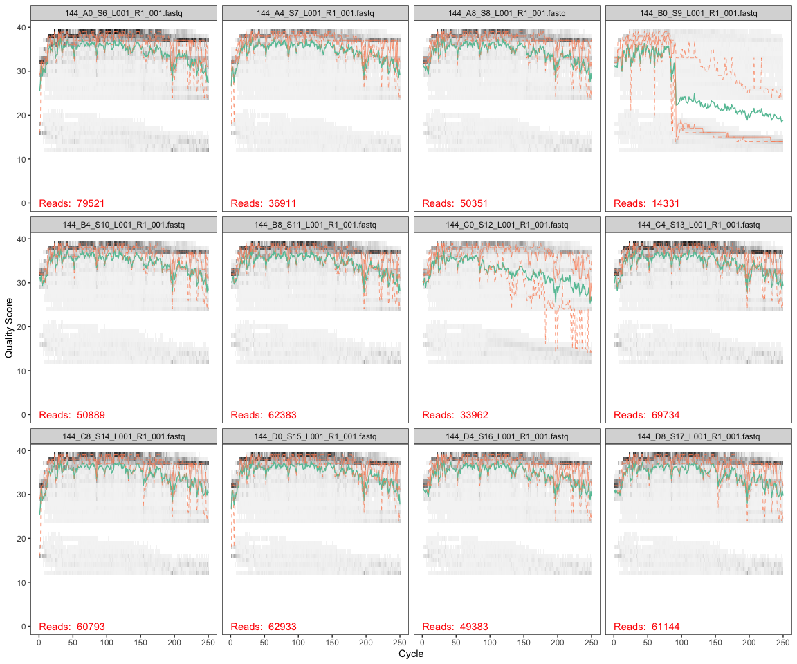
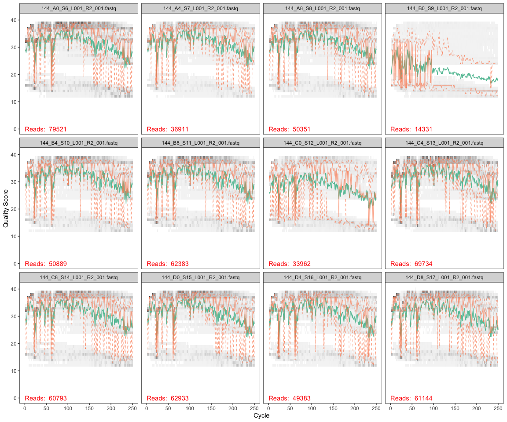
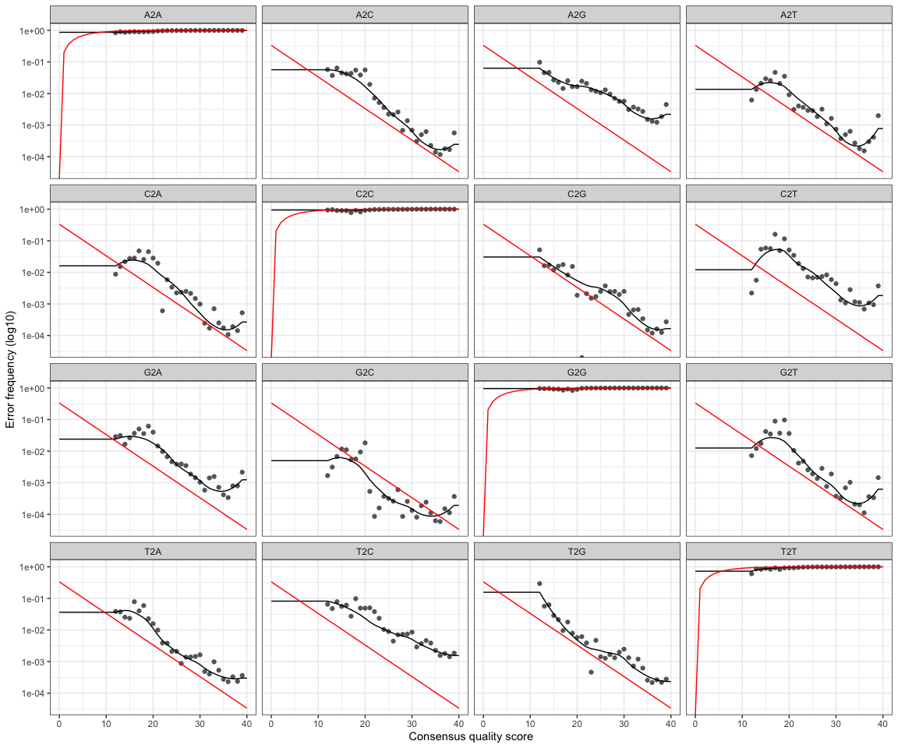
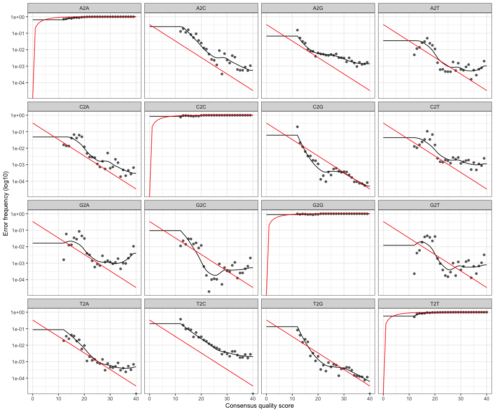

EEMB 144L Week 5 Homework
================
Kerri Luttrell
11/11/2020

This script processes trimmed (w/o primers) sequences through the [DADA2
pipline (v 1.16)](https://benjjneb.github.io/dada2/tutorial.html), which
can be installed following these
[steps](https://benjjneb.github.io/dada2/dada-installation.html)

# Install and Load DADA 2 and ShortRead Bioconducter

# Import File names

``` r
path1 <- "~/Github/144l_students/Input_Data/week5/EEMB144L_2018_fastq"
#2 files for each sample
fnFs1 <- list.files(path1, pattern ="_R1_001.fastq", full.names= TRUE)
fnRs1 <- list.files(path1, pattern ="_R2_001.fastq", full.names= TRUE)
```

# Retrieve orientation of primers

``` r
#store the  forward and reverse primers
FWD1 = "GTGYCAGCMGCCGCGGTAA"
REV1 = "GGACTACNVGGGTWTCTAAT"

#now store all the orientations of your forward and reverse  primers

allOrients1 <- function(primer) {
  # The Biostrings works w/ DNAString objects rather than character vectors
  require(Biostrings)
  dna1 <- DNAString(primer) 
  orients1 <- c(Forward = dna1, Complement = complement(dna1), Reverse = reverse(dna1), 
               RevComp = reverseComplement(dna1))
  # Convert back to character vector
  return(sapply(orients1, toString))  
}

#store the fwd and reverse oreintations separately
FWD.orients1 <- allOrients1(FWD1)
REV.orients1 <- allOrients1(REV1)

#view the orientations of the primers
FWD.orients1
```

    ##               Forward            Complement               Reverse 
    ## "GTGYCAGCMGCCGCGGTAA" "CACRGTCGKCGGCGCCATT" "AATGGCGCCGMCGACYGTG" 
    ##               RevComp 
    ## "TTACCGCGGCKGCTGRCAC"

``` r
REV.orients1
```

    ##                Forward             Complement                Reverse 
    ## "GGACTACNVGGGTWTCTAAT" "CCTGATGNBCCCAWAGATTA" "TAATCTWTGGGVNCATCAGG" 
    ##                RevComp 
    ## "ATTAGAWACCCBNGTAGTCC"

# search for Primers

``` r
primerHits1 <- function(primer, fn) {
  # Counts number of reads in which the primer is found
  nhits1 <- vcountPattern(primer, sread(readFastq(fn)), fixed = FALSE)
  return(sum(nhits1 > 0))
}
#function looks for forward and reverse "hit" sequences and returns a vector for the results of each of these -> tally for amt per hit and then we make a table with output 

rbind(FWD.ForwardReads1 = sapply(FWD.orients1, primerHits1, fn = fnFs1[[1]]), 
      FWD.ReverseReads1 = sapply(FWD.orients1, primerHits1, fn = fnRs1[[1]]), 
      REV.ForwardReads1 = sapply(REV.orients1, primerHits1, fn = fnFs1[[1]]), 
      REV.ReverseReads1 = sapply(REV.orients1, primerHits1, fn = fnRs1[[1]]))
```

    ##                   Forward Complement Reverse RevComp
    ## FWD.ForwardReads1       0          0       0       0
    ## FWD.ReverseReads1       0          0       0     283
    ## REV.ForwardReads1       0          0       0    1195
    ## REV.ReverseReads1       0          0       0       0

There are hits of the FWD.ReverseReads1 and the REV.ForwardReads1 in the
Rev Comp, so we will trim those out later with the MergePairs function,
by adding Overhang=T.

# Inspect read quality profiles

Quality profiles to assess the quality of the sequencing run.

## Forward reads

``` r
plotQualityProfile(fnFs1[1:12])
```

<!-- -->

All samples start to decline in quality above 200 bp. Sample
144\_B0\_S9-L001\_R1\_001.fastq. has a sharp dropoff in quality at 110
bp.

Sample 144\_C0\_S12-L001\_R1\_001.fastq.has a more gradual, yet
noticeable decline around 110 bp. However, it is not as severe as the
previous sample, so we can probably keep it.

Both of the samples with lower quality scores have fewer reads than the
other samples. The lowest quality being in sample
144\_B0\_S9-L001\_R1\_001.fast, with just over 14,000 reads (compared to
most samples ranging from 50-70k).

We will truncate the forward reads at position 200 (trimming the last 10
nucleotides).

## Reverse reads

``` r
plotQualityProfile(fnRs1[1:12])
```

<!-- -->

Lots of variability in quality, much lower quality than that of forward
reads, as is expected. Right hand tail quality declines at \~160 bp.
Left hand tail of samples has fairly low quality too. Sample
144\_B0\_S9-L001\_R2\_001.fastq has noticeably poorer waulity than all
other samples with about 50% of the quality score of other samples at
any given time point.

Based on these profiles, truncate the reverse reads at position 160 bp,
where the quality distribution crashes.

# Filtering and Trimming

``` r
#Get the sample names
#define the basename of the FnFs as the first part of each fastQ file name until "_L"
#apply this to all samples
sample.names1 <- sapply(strsplit(basename(fnFs1),"_L"), `[`,1)
sample.names1
```

    ##  [1] "144_A0_S6"  "144_A4_S7"  "144_A8_S8"  "144_B0_S9"  "144_B4_S10"
    ##  [6] "144_B8_S11" "144_C0_S12" "144_C4_S13" "144_C8_S14" "144_D0_S15"
    ## [11] "144_D4_S16" "144_D8_S17" "144_E0_S18" "144_E4_S19" "144_E8_S20"
    ## [16] "144_F0_S21" "144_F4_S22" "144_F8_S23" "144_G0_S24" "144_G4_S25"
    ## [21] "144_G8_S26" "144_H0_S27" "144_H4_S28" "144_H8_S29"

``` r
#create a "filtered" folder in the working directory as a place to put all the new filtered fastQ files
filt_path1 <- file.path(path1,"filtered")
#add the appropriate designation string to any new files made that will be put into the "filtered" folder
filtFs1 <- file.path(filt_path1, paste0(sample.names1, "_F_filt.fastq"))
filtRs1 <- file.path(filt_path1, paste0(sample.names1, "_R_filt.fastq"))
```

``` r
out1 <- filterAndTrim(fnFs1, filtFs1, fnRs1, filtRs1, truncLen = c(200,150),  maxN = 0, maxEE = c(2,2), truncQ = 2, rm.phix = TRUE, compress = TRUE) 
#truncLen this is where we actually want to trim our reads, respectively

# look at the output. this tells you how many reads were removed. 
```

Reads out is lower than reads in, signifying function worked and “error”
reads were removed. Sample 144\_B0\_S9-L001\_R1\_001.fastq had over
11000 reads removed reflective of its poor quality.

# Learn the error rates

``` r
errF1 <- learnErrors(filtFs1, multithread = TRUE)
```

    ## 110953600 total bases in 554768 reads from 12 samples will be used for learning the error rates.

``` r
errR1 <- learnErrors(filtRs1, multithread = TRUE)
```

    ## 100750050 total bases in 671667 reads from 15 samples will be used for learning the error rates.




The estimated error rates are a pretty good fit for all and the observed
error rates.

# Dereplication

``` r
derepFs1 <- derepFastq(filtFs1, verbose = TRUE)
```

    ## Dereplicating sequence entries in Fastq file: ~/Github/144l_students/Input_Data/week5/EEMB144L_2018_fastq/filtered/144_A0_S6_F_filt.fastq

    ## Encountered 17611 unique sequences from 70868 total sequences read.

    ## Dereplicating sequence entries in Fastq file: ~/Github/144l_students/Input_Data/week5/EEMB144L_2018_fastq/filtered/144_A4_S7_F_filt.fastq

    ## Encountered 8523 unique sequences from 33172 total sequences read.

    ## Dereplicating sequence entries in Fastq file: ~/Github/144l_students/Input_Data/week5/EEMB144L_2018_fastq/filtered/144_A8_S8_F_filt.fastq

    ## Encountered 11776 unique sequences from 45283 total sequences read.

    ## Dereplicating sequence entries in Fastq file: ~/Github/144l_students/Input_Data/week5/EEMB144L_2018_fastq/filtered/144_B0_S9_F_filt.fastq

    ## Encountered 1394 unique sequences from 3286 total sequences read.

    ## Dereplicating sequence entries in Fastq file: ~/Github/144l_students/Input_Data/week5/EEMB144L_2018_fastq/filtered/144_B4_S10_F_filt.fastq

    ## Encountered 10927 unique sequences from 45432 total sequences read.

    ## Dereplicating sequence entries in Fastq file: ~/Github/144l_students/Input_Data/week5/EEMB144L_2018_fastq/filtered/144_B8_S11_F_filt.fastq

    ## Encountered 13739 unique sequences from 56216 total sequences read.

    ## Dereplicating sequence entries in Fastq file: ~/Github/144l_students/Input_Data/week5/EEMB144L_2018_fastq/filtered/144_C0_S12_F_filt.fastq

    ## Encountered 7426 unique sequences from 25214 total sequences read.

    ## Dereplicating sequence entries in Fastq file: ~/Github/144l_students/Input_Data/week5/EEMB144L_2018_fastq/filtered/144_C4_S13_F_filt.fastq

    ## Encountered 12758 unique sequences from 62942 total sequences read.

    ## Dereplicating sequence entries in Fastq file: ~/Github/144l_students/Input_Data/week5/EEMB144L_2018_fastq/filtered/144_C8_S14_F_filt.fastq

    ## Encountered 12894 unique sequences from 54965 total sequences read.

    ## Dereplicating sequence entries in Fastq file: ~/Github/144l_students/Input_Data/week5/EEMB144L_2018_fastq/filtered/144_D0_S15_F_filt.fastq

    ## Encountered 13967 unique sequences from 57502 total sequences read.

    ## Dereplicating sequence entries in Fastq file: ~/Github/144l_students/Input_Data/week5/EEMB144L_2018_fastq/filtered/144_D4_S16_F_filt.fastq

    ## Encountered 8744 unique sequences from 44769 total sequences read.

    ## Dereplicating sequence entries in Fastq file: ~/Github/144l_students/Input_Data/week5/EEMB144L_2018_fastq/filtered/144_D8_S17_F_filt.fastq

    ## Encountered 13616 unique sequences from 55119 total sequences read.

    ## Dereplicating sequence entries in Fastq file: ~/Github/144l_students/Input_Data/week5/EEMB144L_2018_fastq/filtered/144_E0_S18_F_filt.fastq

    ## Encountered 12580 unique sequences from 49019 total sequences read.

    ## Dereplicating sequence entries in Fastq file: ~/Github/144l_students/Input_Data/week5/EEMB144L_2018_fastq/filtered/144_E4_S19_F_filt.fastq

    ## Encountered 8678 unique sequences from 37467 total sequences read.

    ## Dereplicating sequence entries in Fastq file: ~/Github/144l_students/Input_Data/week5/EEMB144L_2018_fastq/filtered/144_E8_S20_F_filt.fastq

    ## Encountered 7830 unique sequences from 30413 total sequences read.

    ## Dereplicating sequence entries in Fastq file: ~/Github/144l_students/Input_Data/week5/EEMB144L_2018_fastq/filtered/144_F0_S21_F_filt.fastq

    ## Encountered 12981 unique sequences from 49975 total sequences read.

    ## Dereplicating sequence entries in Fastq file: ~/Github/144l_students/Input_Data/week5/EEMB144L_2018_fastq/filtered/144_F4_S22_F_filt.fastq

    ## Encountered 7337 unique sequences from 29889 total sequences read.

    ## Dereplicating sequence entries in Fastq file: ~/Github/144l_students/Input_Data/week5/EEMB144L_2018_fastq/filtered/144_F8_S23_F_filt.fastq

    ## Encountered 7303 unique sequences from 30792 total sequences read.

    ## Dereplicating sequence entries in Fastq file: ~/Github/144l_students/Input_Data/week5/EEMB144L_2018_fastq/filtered/144_G0_S24_F_filt.fastq

    ## Encountered 9886 unique sequences from 37648 total sequences read.

    ## Dereplicating sequence entries in Fastq file: ~/Github/144l_students/Input_Data/week5/EEMB144L_2018_fastq/filtered/144_G4_S25_F_filt.fastq

    ## Encountered 7586 unique sequences from 36506 total sequences read.

    ## Dereplicating sequence entries in Fastq file: ~/Github/144l_students/Input_Data/week5/EEMB144L_2018_fastq/filtered/144_G8_S26_F_filt.fastq

    ## Encountered 7592 unique sequences from 32774 total sequences read.

    ## Dereplicating sequence entries in Fastq file: ~/Github/144l_students/Input_Data/week5/EEMB144L_2018_fastq/filtered/144_H0_S27_F_filt.fastq

    ## Encountered 13584 unique sequences from 59242 total sequences read.

    ## Dereplicating sequence entries in Fastq file: ~/Github/144l_students/Input_Data/week5/EEMB144L_2018_fastq/filtered/144_H4_S28_F_filt.fastq

    ## Encountered 5261 unique sequences from 25062 total sequences read.

    ## Dereplicating sequence entries in Fastq file: ~/Github/144l_students/Input_Data/week5/EEMB144L_2018_fastq/filtered/144_H8_S29_F_filt.fastq

    ## Encountered 8537 unique sequences from 33766 total sequences read.

``` r
derepRs1 <- derepFastq(filtRs1, verbose = TRUE)
```

    ## Dereplicating sequence entries in Fastq file: ~/Github/144l_students/Input_Data/week5/EEMB144L_2018_fastq/filtered/144_A0_S6_R_filt.fastq

    ## Encountered 24175 unique sequences from 70868 total sequences read.

    ## Dereplicating sequence entries in Fastq file: ~/Github/144l_students/Input_Data/week5/EEMB144L_2018_fastq/filtered/144_A4_S7_R_filt.fastq

    ## Encountered 11316 unique sequences from 33172 total sequences read.

    ## Dereplicating sequence entries in Fastq file: ~/Github/144l_students/Input_Data/week5/EEMB144L_2018_fastq/filtered/144_A8_S8_R_filt.fastq

    ## Encountered 16625 unique sequences from 45283 total sequences read.

    ## Dereplicating sequence entries in Fastq file: ~/Github/144l_students/Input_Data/week5/EEMB144L_2018_fastq/filtered/144_B0_S9_R_filt.fastq

    ## Encountered 1770 unique sequences from 3286 total sequences read.

    ## Dereplicating sequence entries in Fastq file: ~/Github/144l_students/Input_Data/week5/EEMB144L_2018_fastq/filtered/144_B4_S10_R_filt.fastq

    ## Encountered 15567 unique sequences from 45432 total sequences read.

    ## Dereplicating sequence entries in Fastq file: ~/Github/144l_students/Input_Data/week5/EEMB144L_2018_fastq/filtered/144_B8_S11_R_filt.fastq

    ## Encountered 20652 unique sequences from 56216 total sequences read.

    ## Dereplicating sequence entries in Fastq file: ~/Github/144l_students/Input_Data/week5/EEMB144L_2018_fastq/filtered/144_C0_S12_R_filt.fastq

    ## Encountered 12162 unique sequences from 25214 total sequences read.

    ## Dereplicating sequence entries in Fastq file: ~/Github/144l_students/Input_Data/week5/EEMB144L_2018_fastq/filtered/144_C4_S13_R_filt.fastq

    ## Encountered 19438 unique sequences from 62942 total sequences read.

    ## Dereplicating sequence entries in Fastq file: ~/Github/144l_students/Input_Data/week5/EEMB144L_2018_fastq/filtered/144_C8_S14_R_filt.fastq

    ## Encountered 18981 unique sequences from 54965 total sequences read.

    ## Dereplicating sequence entries in Fastq file: ~/Github/144l_students/Input_Data/week5/EEMB144L_2018_fastq/filtered/144_D0_S15_R_filt.fastq

    ## Encountered 20947 unique sequences from 57502 total sequences read.

    ## Dereplicating sequence entries in Fastq file: ~/Github/144l_students/Input_Data/week5/EEMB144L_2018_fastq/filtered/144_D4_S16_R_filt.fastq

    ## Encountered 14888 unique sequences from 44769 total sequences read.

    ## Dereplicating sequence entries in Fastq file: ~/Github/144l_students/Input_Data/week5/EEMB144L_2018_fastq/filtered/144_D8_S17_R_filt.fastq

    ## Encountered 21171 unique sequences from 55119 total sequences read.

    ## Dereplicating sequence entries in Fastq file: ~/Github/144l_students/Input_Data/week5/EEMB144L_2018_fastq/filtered/144_E0_S18_R_filt.fastq

    ## Encountered 18785 unique sequences from 49019 total sequences read.

    ## Dereplicating sequence entries in Fastq file: ~/Github/144l_students/Input_Data/week5/EEMB144L_2018_fastq/filtered/144_E4_S19_R_filt.fastq

    ## Encountered 14665 unique sequences from 37467 total sequences read.

    ## Dereplicating sequence entries in Fastq file: ~/Github/144l_students/Input_Data/week5/EEMB144L_2018_fastq/filtered/144_E8_S20_R_filt.fastq

    ## Encountered 15767 unique sequences from 30413 total sequences read.

    ## Dereplicating sequence entries in Fastq file: ~/Github/144l_students/Input_Data/week5/EEMB144L_2018_fastq/filtered/144_F0_S21_R_filt.fastq

    ## Encountered 19823 unique sequences from 49975 total sequences read.

    ## Dereplicating sequence entries in Fastq file: ~/Github/144l_students/Input_Data/week5/EEMB144L_2018_fastq/filtered/144_F4_S22_R_filt.fastq

    ## Encountered 10390 unique sequences from 29889 total sequences read.

    ## Dereplicating sequence entries in Fastq file: ~/Github/144l_students/Input_Data/week5/EEMB144L_2018_fastq/filtered/144_F8_S23_R_filt.fastq

    ## Encountered 10140 unique sequences from 30792 total sequences read.

    ## Dereplicating sequence entries in Fastq file: ~/Github/144l_students/Input_Data/week5/EEMB144L_2018_fastq/filtered/144_G0_S24_R_filt.fastq

    ## Encountered 14019 unique sequences from 37648 total sequences read.

    ## Dereplicating sequence entries in Fastq file: ~/Github/144l_students/Input_Data/week5/EEMB144L_2018_fastq/filtered/144_G4_S25_R_filt.fastq

    ## Encountered 12399 unique sequences from 36506 total sequences read.

    ## Dereplicating sequence entries in Fastq file: ~/Github/144l_students/Input_Data/week5/EEMB144L_2018_fastq/filtered/144_G8_S26_R_filt.fastq

    ## Encountered 10835 unique sequences from 32774 total sequences read.

    ## Dereplicating sequence entries in Fastq file: ~/Github/144l_students/Input_Data/week5/EEMB144L_2018_fastq/filtered/144_H0_S27_R_filt.fastq

    ## Encountered 20646 unique sequences from 59242 total sequences read.

    ## Dereplicating sequence entries in Fastq file: ~/Github/144l_students/Input_Data/week5/EEMB144L_2018_fastq/filtered/144_H4_S28_R_filt.fastq

    ## Encountered 10356 unique sequences from 25062 total sequences read.

    ## Dereplicating sequence entries in Fastq file: ~/Github/144l_students/Input_Data/week5/EEMB144L_2018_fastq/filtered/144_H8_S29_R_filt.fastq

    ## Encountered 12193 unique sequences from 33766 total sequences read.

``` r
# Name the derep-class objects by the sample names
names(derepFs1) <- sample.names1
names(derepRs1) <- sample.names1
```

# Infer the sequence variants

``` r
dadaFs1 <- dada(derepFs1, err = errF1, multithread = TRUE)
```

    ## Sample 1 - 70868 reads in 17611 unique sequences.
    ## Sample 2 - 33172 reads in 8523 unique sequences.
    ## Sample 3 - 45283 reads in 11776 unique sequences.
    ## Sample 4 - 3286 reads in 1394 unique sequences.
    ## Sample 5 - 45432 reads in 10927 unique sequences.
    ## Sample 6 - 56216 reads in 13739 unique sequences.
    ## Sample 7 - 25214 reads in 7426 unique sequences.
    ## Sample 8 - 62942 reads in 12758 unique sequences.
    ## Sample 9 - 54965 reads in 12894 unique sequences.
    ## Sample 10 - 57502 reads in 13967 unique sequences.
    ## Sample 11 - 44769 reads in 8744 unique sequences.
    ## Sample 12 - 55119 reads in 13616 unique sequences.
    ## Sample 13 - 49019 reads in 12580 unique sequences.
    ## Sample 14 - 37467 reads in 8678 unique sequences.
    ## Sample 15 - 30413 reads in 7830 unique sequences.
    ## Sample 16 - 49975 reads in 12981 unique sequences.
    ## Sample 17 - 29889 reads in 7337 unique sequences.
    ## Sample 18 - 30792 reads in 7303 unique sequences.
    ## Sample 19 - 37648 reads in 9886 unique sequences.
    ## Sample 20 - 36506 reads in 7586 unique sequences.
    ## Sample 21 - 32774 reads in 7592 unique sequences.
    ## Sample 22 - 59242 reads in 13584 unique sequences.
    ## Sample 23 - 25062 reads in 5261 unique sequences.
    ## Sample 24 - 33766 reads in 8537 unique sequences.

``` r
dadaRs1 <- dada(derepRs1, err = errR1, multithread = TRUE)
```

    ## Sample 1 - 70868 reads in 24175 unique sequences.
    ## Sample 2 - 33172 reads in 11316 unique sequences.
    ## Sample 3 - 45283 reads in 16625 unique sequences.
    ## Sample 4 - 3286 reads in 1770 unique sequences.
    ## Sample 5 - 45432 reads in 15567 unique sequences.
    ## Sample 6 - 56216 reads in 20652 unique sequences.
    ## Sample 7 - 25214 reads in 12162 unique sequences.
    ## Sample 8 - 62942 reads in 19438 unique sequences.
    ## Sample 9 - 54965 reads in 18981 unique sequences.
    ## Sample 10 - 57502 reads in 20947 unique sequences.
    ## Sample 11 - 44769 reads in 14888 unique sequences.
    ## Sample 12 - 55119 reads in 21171 unique sequences.
    ## Sample 13 - 49019 reads in 18785 unique sequences.
    ## Sample 14 - 37467 reads in 14665 unique sequences.
    ## Sample 15 - 30413 reads in 15767 unique sequences.
    ## Sample 16 - 49975 reads in 19823 unique sequences.
    ## Sample 17 - 29889 reads in 10390 unique sequences.
    ## Sample 18 - 30792 reads in 10140 unique sequences.
    ## Sample 19 - 37648 reads in 14019 unique sequences.
    ## Sample 20 - 36506 reads in 12399 unique sequences.
    ## Sample 21 - 32774 reads in 10835 unique sequences.
    ## Sample 22 - 59242 reads in 20646 unique sequences.
    ## Sample 23 - 25062 reads in 10356 unique sequences.
    ## Sample 24 - 33766 reads in 12193 unique sequences.

I had hits of the reverse complement in the FWD.ReverseReads and the
REV.ForwardReads, trimedm them here by adding trimOverhang = T.

``` r
mergers1 <- mergePairs(dadaFs1, derepFs1, dadaRs1, derepRs1, verbose = TRUE, trimOverhang = T)
```

    ## 67488 paired-reads (in 337 unique pairings) successfully merged out of 70016 (in 919 pairings) input.

    ## 31521 paired-reads (in 166 unique pairings) successfully merged out of 32548 (in 495 pairings) input.

    ## 43338 paired-reads (in 229 unique pairings) successfully merged out of 44672 (in 637 pairings) input.

    ## 2834 paired-reads (in 70 unique pairings) successfully merged out of 3053 (in 180 pairings) input.

    ## 43547 paired-reads (in 189 unique pairings) successfully merged out of 44815 (in 563 pairings) input.

    ## 53945 paired-reads (in 249 unique pairings) successfully merged out of 55532 (in 682 pairings) input.

    ## 23399 paired-reads (in 207 unique pairings) successfully merged out of 24632 (in 533 pairings) input.

    ## 61134 paired-reads (in 173 unique pairings) successfully merged out of 62173 (in 545 pairings) input.

    ## 53096 paired-reads (in 229 unique pairings) successfully merged out of 54429 (in 574 pairings) input.

    ## 54656 paired-reads (in 298 unique pairings) successfully merged out of 56615 (in 722 pairings) input.

    ## 43396 paired-reads (in 123 unique pairings) successfully merged out of 44304 (in 344 pairings) input.

    ## 53165 paired-reads (in 220 unique pairings) successfully merged out of 54536 (in 555 pairings) input.

    ## 46486 paired-reads (in 265 unique pairings) successfully merged out of 48192 (in 614 pairings) input.

    ## 35900 paired-reads (in 163 unique pairings) successfully merged out of 37001 (in 436 pairings) input.

    ## 28472 paired-reads (in 161 unique pairings) successfully merged out of 29793 (in 525 pairings) input.

    ## 46737 paired-reads (in 255 unique pairings) successfully merged out of 48889 (in 655 pairings) input.

    ## 28793 paired-reads (in 138 unique pairings) successfully merged out of 29584 (in 299 pairings) input.

    ## 29694 paired-reads (in 190 unique pairings) successfully merged out of 30478 (in 355 pairings) input.

    ## 35711 paired-reads (in 226 unique pairings) successfully merged out of 37011 (in 451 pairings) input.

    ## 35287 paired-reads (in 138 unique pairings) successfully merged out of 36111 (in 377 pairings) input.

    ## 31371 paired-reads (in 158 unique pairings) successfully merged out of 32263 (in 325 pairings) input.

    ## 54517 paired-reads (in 302 unique pairings) successfully merged out of 58549 (in 630 pairings) input.

    ## 23994 paired-reads (in 118 unique pairings) successfully merged out of 24764 (in 319 pairings) input.

    ## 32510 paired-reads (in 162 unique pairings) successfully merged out of 33297 (in 320 pairings) input.

``` r
head(mergers1[[1]])
```

    ##                                                                                                                                                                                                                                                        sequence
    ## 1 TACGGAGGGTGCAAGCGTTACTCGGAATCACTGGGCGTAAAGAGCGTGTAGGCGGATAGTTAAGTTTGAAGTGAAATCCTATGGCTCAACCATAGAACTGCTTTGAAAACTGATTATCTAGAATATGGGAGAGGTAGATGGAATTTCTGGTGTAGGGGTAAAATCCGTAGAGATCAGAAGGAATACCGATTGCGAAGGCGATCTACTGGAACATTATTGACGCTGAGACGCGAAAGCGTGGGGAGCAAACAGG
    ## 2 TACGGAGGGTCCGAGCGTTAATCGGAATTACTGGGCGTAAAGCGCGCGTAGGTGGTTTTGTCAGTCAGATGTGAAAGCCCAGGGCTCAACCTTGGAACTGCACCTGATACTGCAAGACTAGAGTACAATAGAGGGGAGTGGAATTTCCGGTGTAGCGGTGAAATGCGTAGAGATCGGAAGGAACACCAGTGGCGAAGGCGACTCCCTGGATTGATACTGACACTGAGGTGCGAAAGCGTGGGGAGCAAACAGG
    ## 3 TACGGAAGGTGCAAGCGTTAATCGGAATTACTGGGCGTAAAGCGCGCGTAGGTGGTTTGTTAAGTTGGATGTGAAAGCCCTGGGCTCAACCTAGGAACTGCATCCAAAACTAACTCACTAGAGTACGATAGAGGGAGGTAGAATTCATAGTGTAGCGGTGGAATGCGTAGATATTATGAAGAATACCAGTGGCGAAGGCGGCCTCCTGGATCTGTACTGACACTGAGGTGCGAAAGCGTGGGTAGCGAACAGG
    ## 4 TACGAAGGGACCTAGCGTAGTTCGGAATTACTGGGCTTAAAGAGTTCGTAGGTGGTTGAAAAAGTTAGTGGTGAAATCCCAGAGCTTAACTCTGGAACTGCCATTAAAACTTTTCAGCTAGAGTATGATAGAGGAAAGCAGAATTTCTAGTGTAGAGGTGAAATTCGTAGATATTAGAAAGAATACCAATTGCGAAGGCAGCTTTCTGGATCATTACTGACACTGAGGAACGAAAGCATGGGTAGCGAAGAGG
    ## 5 TACGAAGGGACCTAGCGTAGTTCGGAATTACTGGGCTTAAAGAGTTCGTAGGTGGTTGAAAAAGTTAGTGGTGAAATCCCAGAGCTTAACTCTGGAACTGCCATTAAAACTTTTCAGCTAGAGTATGATAGAGGAAAGCAGAATTTCTAGTGTAGAGGTGAAATTCGTAGATATTAGAAAGAATACCAATTGCGAAGGCAGCTTTCTGGATCATTACTGACACTGAGGAGCGAAAGCATGGGTAGCGAAGAGG
    ## 6 TACGGGAGTGGCAAGCGTTATCCGGAATTATTGGGCGTAAAGCGTCCGCAGGCGGCCCTTCAAGTCTGCTGTTAAAAAGTGGAGCTTAACTCCATCATGGCAGTGGAAACTGAGGGGCTTGAGTGTGGTAGGGGCAGAGGGAATTCCCGGTGTAGCGGTGAAATGCGTAGATATCGGGAAGAACACCAGTGGCGAAGGCGCTCTGCTGGGCCATCACTGACGCTCATGGACGAAAGCCAGGGGAGCGAAAGGG
    ##   abundance forward reverse nmatch nmismatch nindel prefer accept
    ## 1      3773       2       1     97         0      0      1   TRUE
    ## 2      3731       3       3     97         0      0      1   TRUE
    ## 3      3139       4       4     97         0      0      1   TRUE
    ## 4      3038       1       2     97         0      0      1   TRUE
    ## 5      2715       1       5     97         0      0      1   TRUE
    ## 6      2390       5       6     97         0      0      1   TRUE

All the nmatch are the same across samples because we uniformly trimmed
the amplicons.

``` r
saveRDS(mergers1, "~/Github/144l_students/Input_Data/week5/144L_dada_merged1.rds")
```

``` r
seqtab1 <- makeSequenceTable(mergers1)
dim(seqtab1) # samples by unique sequence
```

    ## [1]  24 970

``` r
table(nchar(getSequences(seqtab1))) 
```

    ## 
    ## 252 253 254 255 256 257 258 265 266 270 
    ##  25 873  52   4   5   2   4   1   1   3

# Remove the Chimeras

``` r
seqtab.nochim1 <- removeBimeraDenovo(seqtab1, verbose = TRUE)
```

    ## Identified 81 bimeras out of 970 input sequences.

``` r
dim(seqtab.nochim1)
```

    ## [1]  24 889

``` r
sum(seqtab.nochim1)/sum(seqtab1)
```

    ## [1] 0.9929833

99% of sequences are not chimeras.

# Assign taxonomy using a reference database

Here we are referencing the Silva database

``` r
taxa1 <- assignTaxonomy(seqtab.nochim1,"~/Github/144l_students/Input_Data/week5/silva_nr_v138_train_set.fa", multithread = TRUE)
```

``` r
saveRDS(t(seqtab.nochim1), "~/Github/144l_students/Input_Data/week5/144L_seqtab-nochimtaxa.rds")
saveRDS(taxa1,"~/Github/144l_students/Input_Data/week5/144L_taxa.rds")
```

Through the dada2 pipeline I created two tables, one including sequence
assignmenets and one with all the taxa. When cleaning the sequence data,
I plotted quality profiles of the forward and reverse reads. The
significantly poorer quality and lower number of reads for Sample
144\_B0\_S9-L001\_R1\_001.fastq may be reason to discard it from future
analysis. All other quality profiles performed as expected.The graphs
for error rates had negative slopes and fit the points well, showing
that error rates drop with increasing quality. This allowed me to
proceed with confidence and create my tables.
